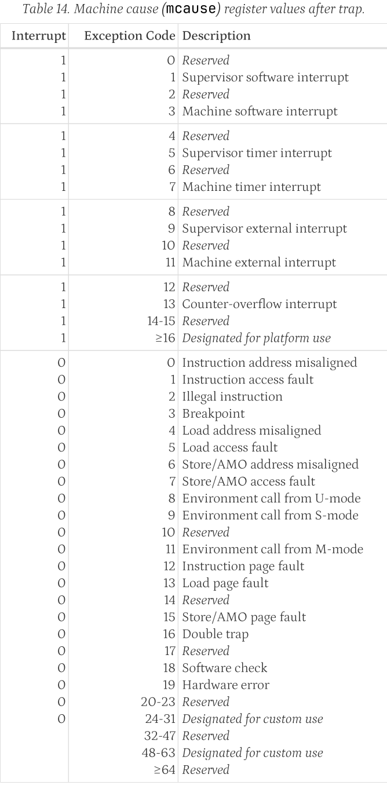
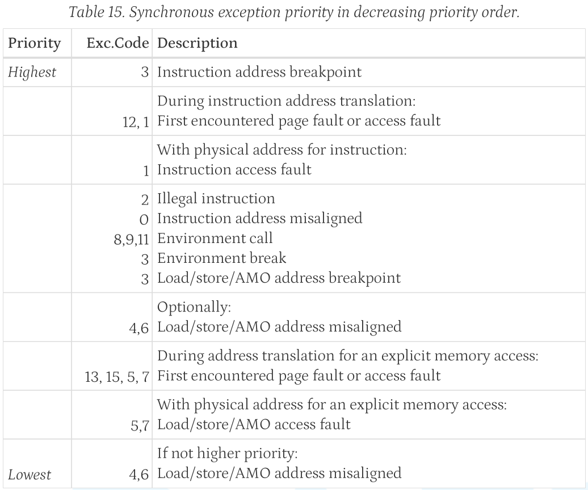

# 环境

没必要用vim。

关于IntelliSense，VSCode需要安装`c/c++`、`Makefile Tools`插件，至少这在PA1中还有点用。到PA2的abstract machine中，这个插件貌似就没法识别出`gcc -D`定义的一堆define了❓

> 因为是用make进行编译的复杂项目，`c/c++` IntelliSense 需要知道具体是怎么make的，所以必须安装`Makefile Tools`才不会出现一堆"Identifier not found"红线，见[Configure C/C++ IntelliSense - Configuration providers](https://code.visualstudio.com/docs/cpp/configure-intellisense#_configuration-providers)：`Ctrl+Shift+P` `C/C++ Change Configuration provider` -> Select `Makefile Tools`，"If it identifies only one custom configuration provider, this configuration provider is automatically configured for IntelliSense"

## 调试NEMU

可以配置到VSCode里调试，传入`-nb`打印出make gdb时产出的gdb命令，配置vscode的`launch.json`。

> 以nemu部分的调试为例，`make gdb`给出了`gdb -s /home/hc/ics-pa-2023/nemu/build/riscv32-nemu-interpreter --args /home/hc/ics-pa-2023/nemu/build/riscv32-nemu-interpreter --log=/home/hc/ics-pa-2023/nemu/build/nemu-log.txt`，于是在vscode中生成调试配置文件`launch.json`，Add Configuation，选择`Nemu GDB`
> 
> ```json
> {
>     "version": "0.2.0",
>     "configurations": [
>         {
>             "name": "Nemu GDB",
>             "type": "cppdbg",
>             "preLaunchTask": "Make",
>             "request": "launch",
>             "program": "${workspaceFolder}/build/riscv32-nemu-interpreter",
>             "args": [
>                 "--log=${workspaceFolder}/build/nemu-log.txt",
>             ],
>             "stopAtEntry": false,
>             "cwd": "${fileDirname}",
>             "environment": [],
>             "externalConsole": false,
>             "MIMode": "gdb",
>             "setupCommands": [
>                 {
>                     "description": "Enable pretty-printing for gdb",
>                     "text": "-enable-pretty-printing",
>                     "ignoreFailures": true
>                 },
>                 {
>                     "description": "Set Disassembly Flavor to Intel",
>                     "text": "-gdb-set disassembly-flavor intel",
>                     "ignoreFailures": true
>                 }
>             ]
>         },
>     ]
> }
> ```

其实用惯了gdb，也就`b func` `n` `s` `layout split` `p EXPR`，直接在Terminal里调试也挺方便的。

## 调试AM+客户程序

见[PA2.4](#2.4)

# （需要补习的）前置知识

- RISC-V：PA2是unprivileged，CS61C就够用了。PA3、PA4涉及privileged，PA3要trap，PA4要分页，需要补习。笔记见[Notes](https://github.com/Holence/Notes/blob/main/Arch/RISC-V/RISC-V.md)
- Makefile：虽然PA1中可以不用理解Makefile，但PA2里就需要全部读懂Makefile了，所以最好一开始就掌握make的语法。笔记见[Notes](https://github.com/Holence/Notes/blob/main/Tools/Make/Make.md)
- ELF：PA2.4和PA3.3中都要手写解析ELF，可以看看《System V generic ABI》第四五章，笔记见[Notes](https://github.com/Holence/Notes/blob/main/OS/ELF.md)

# 重要信息

## 关于AM

参考阅读: [一生一芯 - Abstract Machine裸机运行时环境](https://www.bilibili.com/video/BV1Vu4y1s73Y/)

AM最初是为了把ISA和OS解耦，让学生自制的各种ISA的CPU可以跑各种上层系统，AM中把各种不同型号的硬件接口进行抽象，而上层系统都使用AM提供的接口。

nemu相当于是一个可以一次性执行完一段程序最后返回一个return值的cpu，仅仅是一个图灵机，运行完就结束了。

nemu是纯“硬件”的“裸机”，am-kernels里的程序、以及nanos都是上层的客户程序，abstract-machine是两者之间的桥梁，是“裸机”的运行时环境。

AM的五个模块，从前往后对应着计算机历史发展的进程：

- TRM (Turing Machine) 最简单的运行时环境
  - init / halt
  - putch: 最基础的打印字符
  - heap: 规定堆的区间
  - klib: 一些通用（ISA架构无关）的库函数 stdio, stdlib, string
- IOE (I/O Extension) 访问外设的接口: 对接到不同ISA下CPU访问外设的方法
- CTE (Context Extension) 上下文扩展: trap（系统调用，中断，异常）
- VME (Virtual Memory Extension) 虚存扩展
- MPE (Multi-Processor Extension) 多处理器扩展

## 关于fceux红白机模拟器画面无显示

做完声卡后运行红白机模拟器跑mario，发现程序在跑，帧率也有，按I键进入游戏，也可以听到声音，但就是VGA没有任何显示。

解决方法：`/fceux-am/src/drivers/sdl/sdl.cpp`的`FCEUD_Update()`中，把关于刷新屏幕的函数调用`BlitScreen()`以及包裹它的判断都删了，在函数的最前面这样调用就行了。（nemu的声卡开启后，那些判断都无法满足，不懂原理❓）

```c
if(XBuf && (inited&4)) {
  BlitScreen(XBuf);
}
```

## PA4之前的内存分布

`/abstract-machine/scripts/linker.ld`中规定了几个地址，怎么堆在栈的上面❓跟普遍的内存结构模型不一样啊？？

```
PMEM_END:       0x88000000
                👆HEAP
_heap_start:    0x81C1A000
_stack_pointer: 0x81C1A000
                👇STACK
_stack_top:     0x81C12000
lut[128]:       0x81C11230
_pmem_start:    0x80000000
```

还有，也没见`_stack_top`在哪里被使用啊？确实应该添加一个检查是否超过栈顶的代码，不然随手在函数内设个大数组，就把全局变量给抹没了。但这怎么实现，nemu并不知道_stack_top的存在（除非解析elf文件），而这种检测也确实不应该在硬件层面实现❓

> PA3.2: 另一种你可能会碰到的UB是栈溢出, 对, 就是stackoverflow的那个. 检测栈溢出需要一个更强大的运行时环境, AM肯定是无能为力了, 于是就UB吧.

> bad-apple的案例
>
> 这里不能用栈来存大数组！！！
>
> `uint32_t buffer[VIDEO_ROW * VIDEO_COL];`
>
> 因为`/abstract-machine/scripts/linker.ld`中把客户程序的栈区写死了，为0x8000个字节（32KB）
>
> ```
> _stack_top = ALIGN(0x1000);
> . = _stack_top + 0x8000;
> _stack_pointer = .;
> ```
>
> `0x8000 == 32768 Bytes`
>
> 而如果是`128x96`的尺寸，`96 * 128 * 4 == 49152 Bytes`
>
> `buffer`的地址为`0x81C0DFB0`，已经跨越了_stack_top的底线，跑到了全局变量区
>
> 导致`buffer`比`lut`的地址还低，由于buffer[index]是往高处写，就把全局变量区都抹了，所以调用`ioe_write`时函数都找不到了

## 关于优化

做完全部的PA再来优化也不迟

- 看宏不顺眼，手贱把nemu中`pattern_decode`和`pattern_decode_hex`写成了循环的形式，导致运行速度降低了至少40倍，导致mario运行时FPS为0，还原为宏后FPS可以到10（`NR_FRAMESKIP==1`的情况）！
  > 把循环次数固定的部分用宏展开，是最极致的loop unrolling（这里因为可以保证循环次数小于64次，可以全部展开。而若是循环不确定的次数，loop unrolling做的是把4次循环要做的放在一次循环内，减少执行跳转与判断指令的数量）
- nemu中`inst.c`的指令匹配`INSTPAT`是一条条进行的，可以通过统计指令使用的频度调整匹配的顺序。在menuconfig中打开`INST_STATISTIC`选项（自己实现去），观察使用nanos一段时间的[频度](.asset/nanos_inst-statistic.txt)），调整匹配顺序，可以让coremark在“分页+时钟中断的两个pcb并发的nanos”中的分数上升20左右
- nanos跑ftrace，观察nanos和am中函数的调用[频度](.asset/nanos_ftrace-statistic.txt)，但好像并没有很多需要优化的函数
- `make menuconfig`中Enable Debug Information后，会用`-Og`进行编译，会使性能下降！

# PA1

制作简易的调试器（因为硬件都是模拟出来的，打印寄存器、内存也就是打印出数组中的值）。读代码，找到需要调用的函数或需要访问的static变量（应该是需要手动添加include的）。

```
(nemu) x 8 $pc
0x80000000: 0x00000297 0x00028823 0x0102c503 0x00100073 
0x80000010: 0xdeadbeef 0x5a5a5a5a 0x5a5a5a5a 0x5a5a5a5a 
(nemu) px *($pc)
0x00000297
(nemu) px *($pc+4*4)
0xdeadbeef
```

## 1.3

大致就是通过`make menuconfig`运行kconfig工具在terminal的图形化界面中进行个性化配置，产生的`include/config/auto.conf`将会用于`make`的个性化编译，产生的`include/generated/autoconf.h`将会用于c语言代码中的`#ifdef`。

对于那些看不懂的宏定义，可以在makefile中加入一行，让输出预编译的代码（出自[第5课的PPT](http://why.ink:8080/static/slides/ICS2023/05.pdf)）

```makefile
# ./nemu/scripts/build.mk
$(OBJ_DIR)/%.o: %.c
	@echo + CC $<
	@mkdir -p $(dir $@)
	@$(CC) $(CFLAGS) -c -o $@ $<
	
# gcc preprocessing file, 方便理解那些看不懂的宏展开
	@$(CC) $(CFLAGS) -E -MF /dev/null $< | grep -ve '^#' | clang-format - > $(basename $@).i
	
	$(call call_fixdep, $(@:.o=.d), $@)
```

## 1.4

`p EXPR`指令需要自己写表达式求值的工具。

```
(nemu) p <expr>
其中 <expr> 为 <decimal-number>
  | <hexadecimal-number>    # 以"0x"开头
  | <reg_name>              # "$ra" / "$pc"
  | "(" <expr> ")"
  | <expr> "+" <expr>
  | <expr> "-" <expr>
  | <expr> "*" <expr>
  | <expr> "/" <expr>
  | <expr> "==" <expr>
  | <expr> "!=" <expr>
  | <expr> "&&" <expr>
  | "*" <expr>              # 指针解引用（只用支持数值或寄存器的值作为地址，不用支持gdb那样的变量作为地址）
```
 
最后随机生成测试，是先随机出一个表达式（与寄存器、内存相关的不用随机测试，自己手动测几个就行了），然后写入一个`temp.c`的临时文件，编译，开进程运行，`./gen-expr 1000 > input`生成多组结果和表达式

> 过滤除以0的case，可以用signal，但遇到0乘以时`(1 / 0) * 0`，运行却没有异常，这种实在没法探测
>
> 完全可能是很复杂的形态`(6-2*3)*(1 - 2/(1-1))`，到nemu里运行是先计算出`1-1`为0，再`2/0`，肯定会报错的。这种只能运行报错后手动删掉这种case了

最后修改nemu的main函数，读文件，调用`expr()`，对比结果

## 1.5

固定32个可用的watchpoint，用链表分别存储“使用中”、“空闲”队列。

如果`wp_check_changed()`中就只是`nemu_state.state = NEMU_STOP`，那运行时设置`w $pc`，然后一直`c`运行到最后，会到`hostcall.c: invalid_inst()`，说明是已经到了最后，却没退出成功。退出的时候是`ebreak`指令去做`set_nemu_state(NEMU_END, thispc, code)`，这时候就不需要再`wp_check_changed()`了。所以在`wp_check_changed()`中设置`nemu_state.state = NEMU_STOP`时，弄个判断：

```c
if (nemu_state.state != NEMU_END) {
  nemu_state.state = NEMU_STOP;
}
```

## 必答题

过

# PA2

## 2.2

编写RISC-V32I_M的模拟器，在外部用risc-v编译器，编译一些c语言写的rics-v机器码用于测试，之后用nemu运行之。

> [!IMPORTANT]
> - 指令集见《The RISC-V Instruction Set Manual Volume I Unprivileged Architecture》 Instruction Set Listings，其实UCB的green card也都够用了
> - imm解析可以参考[CS61CPU](https://cs61c.org/su24/projects/proj3/#task-7-2-immediate-generator)，要记得imm都是要sign-extend成32/64位的。
> - load进来的数据也要sign-extend
> - 做`mul`、`mulh`时需要把`uint32_t`转换为`int64_t`去做乘法。但由于bit extend的特性，从`uint32_t`到更多位的`int64_t`需要先到`int32_t`再到`int64_t`，这样才能让32位的负数正确地sign-extend扩展为64位的负数。

> [!TIP]
> ecall不用做，等PA3再说

---

为了方便测试，在`/abstract-machine/scripts/platform/nemu.mk`中的NEMUFLAGS加上`-b`，让传入nemu的参数开启batch mode，这样就不用每次开始运行了还要手动`c`运行和`q`退出。之后直接运行`make ARCH=riscv32-nemu run`就能运行所有的测试了。

> [!IMPORTANT]
>  - 至少在做cpu-test时，把`/abstract-machine/Makefile`里把`CFLAGS   += -O2`改为`O0`。在`O2`优化的情况下，发现很多测试编译出来给check函数的`a0`直接就设为了编译器预想的值，根本没有运行nemu计算的指令！！
>  - string和hello-str还需要实现额外的内容才能运行，现在运行会报错的，记得跳过（我就忘了，看到汇编里`sb a0,1016(a5) # a00003f8 <_end+0x1fff73f8>`写着超出了_end的地址，意识到不应该是我的问题，才到文档里查到需要跳过这两个测试）

> [!TIP]
> am-kernels，abstract-machine都是啥？下面两个小节会介绍的。

❓很奇怪，当我在nemu中`make menuconfig`选中了Enable Address Sanitizer后，有时候编译就会报`AddressSanitizer:DEADLYSIGNAL`的错。

---

> [!NOTE]
> RTFSC理解指令执行的过程
>
> `init_monitor()`的部分就是初始化nemu，并装入客户程序的IMAGE到内存pmem，因为是raw binary，pc的起始地址就是0,对应到nemu中的内存地址为0x80000000。之后便进入`engine_start()`，进入sdb互动界面或者`cpu_exec()`，客户程序指令执行的过程发生在`cpu_exec()`中。
>
> `execute()`的循环中`exec_once()`, `s->pc`为当前指令的地址，进入`isa_exec_once()`后，`inst_fetch()`取回二进制指令，静态下一跳地址设置为`s->snpc = s->pc + 4`，进入`decode_exec()`，动态下一跳地址默认设为`s->dnpc = s->snpc`，在指令执行的过程中，那些跳转指令会改变`s->dnpc`的值。后面是一堆附带goto “INSTPAT_END”的block，一旦`(((uint64_t)INSTPAT_INST(s) >> shift) & mask) == key`，即匹配成功，进入`decode_operand()`解析立即数和读取寄存器src1和src2，最后执行对应的`EXECUTE_EXPR`。出去的时候`x0`寄存器要手动归零（因为是软件实现的不作判断，写入就写入了，硬件写入`x0`是不通的）。出去让cpu的下一跳设为`cpu.pc = s->dnpc`，最后处理trace的信息、处理外设。只要`nemu_state.state == NEMU_RUNNING`，就以此循环往复。
>
> 直到客户程序发出ebreak的指令而`NEMU_END`（要么是正常运行结束`ret==0`，要么是中途异常退出`ret!=0`），或者nemu出现内部错误而`NEMU_ABORT`，结束`execute()`的循环，退出nemu。

## Makefile解析: am-kernels on abstract-machine

运行am-kernels中测试的时候，`make ARCH=riscv32-nemu ALL=dummy run`会生成`Makefile.dummy`，其中的内容为

```
NAME = dummy
SRCS = tests/dummy.c
include /abstract-machine/Makefile
```

接下来会`make -s -f Makefile.dummy ARCH=$(ARCH) $(MAKECMDGOALS)`去运行这个Makefile，其实就是在引用`/abstract-machine/Makefile`中的内容（PA2.3中会要求仔细阅读），其中先编译生成一堆OBJS，再`@$(LD) $(LDFLAGS) -o $(IMAGE).elf --start-group $(LINKAGE) --end-group`链接成ELF文件，最后用`@$(OBJCOPY) -S --set-section-flags .bss=alloc,contents -O binary $(IMAGE).elf $(IMAGE).bin`抽取出部分内容成为裸二进制文件，这是nemu需要的程序文件IMAGE（.bin），最后通过`$(MAKE) -C $(NEMU_HOME) ISA=$(ISA) run ARGS="$(NEMUFLAGS)" IMG=$(IMAGE).bin`运行nemu中Makefile的`make run`。

```makefile
image: $(IMAGE).elf
	@$(OBJDUMP) -d $(IMAGE).elf > $(IMAGE).txt
	@echo + OBJCOPY "->" $(IMAGE_REL).bin

# -S (--strip-all)
#    Do not copy relocation and symbol information from the source file.  Also deletes debug sections.
# -S之后只是少了些附加信息，依旧可以被linux运行、被readelf、被objdump
# -O binary 是保留raw binary file，不能被linux运行、被readelf、被objdump
    @$(OBJCOPY) -S --set-section-flags .bss=alloc,contents -O binary $(IMAGE).elf $(IMAGE).bin
```

## 2.3

实现几个与ISA无关的通用库函数，理解abstract machine作为nemu(cpu)与OS之间的中间层的奥义。

客户程序依赖于AM，见[AM的五个模块](#关于AM)

nemu的运行是直接读入一整个IMAGE，是am-kernels的客户程序和abstract-machine全部编译、链接在一起的结果，在nemu看来就是一堆指令，相当于开机后就只跑这一个运行环境中的一个程序。也就是说客户程序通过abstract-machine的加持，就可以跑在任意一种CPU上（物理世界的CPU也行）。

```c
// init: `start.S: _start()`，设置栈的起始位置`sp = _stack_pointer`（`/abstract-machine/scripts/linker.ld`中设定的地址），跳转到trm.c中的`_trm_init`
void _trm_init() {
  int ret = main(mainargs);
  halt(ret);
}
// halt: 将客户程序`main()`的返回值，约定使用`a0`寄存器传返回值，通过`ebreak`指令让nemu终止，并将传入的返回值作为`nemu_state.halt_ret`，作为判断`Good/Bad Trap`的依据，最后退出nemu。
```

> gcc的输出也能说明这点，单纯的程序文件的机器码并不包含`_start`和`ebreak`，这些都是运行环境（操作系统）附加的东西
>
> ```bash
> cd /am-kernels/tests/cpu-tests
> 
> # 仅输出汇编
> gcc -S tests/dummy.c -o dummy.s
> # 或输出机器码
> gcc -c tests/dummy.c -o dummy.o
> objdump -d dummy.o
> # 发现里面没有_start和hlt (hlt应该就是和ebreak同样的存在吧❓)
> # dummy.o是不能被操作系统运行的
> 
> # 编译（并链接运行环境），生成可执行文件
> gcc tests/dummy.c -o dummy
> objdump -d dummy
> # 发现在_start函数中有hlt，这并不是main()函数
> ```

## 2.4

itrace、iringbuf、mtrace就在nemu里动动手脚即可。

### ftrace

- 要ftrace的话，运行nemu就需要额外传入elf文件（因为`$(IMAGE).bin`文件是raw binary，啥都没了），自己规定用`-e xxx.elf`的格式传入
- ftrace需要读取elf，要找出当前运行的指令行对应在哪个函数内，要找的是Section里的symtab和strtab两个表，symtab中有函数的地址信息，strtab里有所有字符串的信息。所以需要定位到Section Header Table，找到其中symtab和strtab两个表的地址。运行程序时碰到`jalr`和`jal`两个指令，判断是call还是ret，看当前指令的pc位于symtab中哪个function的地址范围内，则查找到strtab中该函数的名字。
- ftrace实现出来只是在实时打印全部的函数调用过程，用个int depth记录深度然后打印缩进即可，感觉也没多少机会会用这个功能。若要实现backtrace打印某个时刻的函数调用栈，得用栈的数据结构push、pop记录函数，懒得做了。

修改am中的`/abstract-machine/scripts/platform/nemu.mk`，添加一个target方便开启ftrace模式：

```makefile
# make ARCH=riscv32-nemu run_ftrace 
run_ftrace: image
	$(MAKE) -C $(NEMU_HOME) ISA=$(ISA) run ARGS="-e $(IMAGE).elf $(NEMUFLAGS)" IMG=$(IMAGE).bin
```

> [!NOTE]
> 不匹配的函数调用和返回，尝试结合反汇编结果, 分析为什么会出现这一现象：看反汇编代码，在f2中调用f1的是正常的`jalr rs`（`jalr ra, rs, 0`），所以触发打印log`call f1`，而f1跳向f0用的是`jr`（`jalr x0, rs, 0`），也就是不把pc存到`ra`就跳出去，将来不用跳回到这条指令+4的地方，而是直接跳回到f1被调用的地方，也就是f2中调用处+4的地方。`jr`指令因为没有存`ra`，也就没被monitor视为是在call，所以从f1跳入f0的时候并不会触发打印`call f0`，而f0要返回了，ret指令会触发打印`ret f0`，所以就出现了`call f1`接着`ret f0`的现象。
>
> 同理，为什么`call f1`对应的是`ret f3`？是因为f0中也是`jr`，`call f1`后隐藏地`call f0`，又隐藏地`call f3`，f3里正常调用f2两次，出来的时候自然打印了`ret f3`。
>
> 这里如果把`jr`这种情况也算作call的话，并不能解决问题，因为`jr`没有对应的`ret`，所以会匹配不上的。
> 
> ```
>   Call f2
>     Call f1 # then call f0, call f3
>       Call f2
>         Call f1 # then call f0
>         Ret  f0
>       Ret  f2
>       Call f2
>         Call f1 # then call f0
>         Ret  f0
>       Ret  f2
>     Ret  f3
>   Ret  f2
> ```

### 编写更多的测试

要编写详尽的test来测试klib，懒得自己写了，看有人引用了glibc的测试，我也引用一下吧: https://github.com/alelievr/libft-unit-test/blob/master/hardcore-mode/

> [!IMPORTANT]
> 用am-kernels的测试程序：
>   - 保证am-kernels测试程序的正确: native + glibc 跑 am-kernels
>   - 保证klib正确: native + klib 跑 am-kernels的klib-tests
>   - 保证am与nemu硬件接口的正确: native + klib 跑 am-kernels的am-test
>
>     在native上测试klib，并不能跳入klib里的函数❓在klib还没做printf的阶段，只能用二分法找到出错的用例定位到是哪个klib里的函数有问题，然后把对应的klib函数和测试用例复制到一个临时c中调试、修改（最好把函数名修改掉，如果就是什么strcmp，它也不报错，直接神不知鬼不觉地就去用c的库了？）
>   - 保证nemu正确: nemu + glibc 跑 am-kernels（后面有difftest就更全面了）

### difftest

difftest部分，`/nemu/src/cpu/difftest/ref.c`没有任何用处，在`nemu/src/cpu/difftest/dut.c`的`init_difftest()`中已经用`dlsym()`去`/nemu/tools/spike-diff/build/riscv32-spike-so`去寻找函数了，其实函数在`/nemu/tools/spike-diff/difftest.cc`中。

寻找spike中定义的寄存器顺序，在`/nemu/tools/spike-diff/repo/disasm/regnames.cc`中有，发现和nemu是一致的。

## 2.5

内存映射：不同外设的寄存器被分别设定（约定）到nemu内存中的不同区域（均是高于0xa0000000的一个个片区），给CPU的同样是读写内存的指令，但若发现地址不是普通内存的地址，则转而读写各种外设内部的寄存器。

CPU方面，在nemu架构中，会被编译为访问内存的指令，从而通过`paddr_read()`/`paddr_write()`判断为不是普通内存地址后（nemu中外设的真实存储空间不在`pmem`数组里，而是`init_map()`里`malloc()`出来的堆空间。毕竟这地址本来就是虚拟的，读写的地方就是要到外设的寄存器，不在内存里的），进入`mmio_read`/`mmio_write`，根据nemu开机时`init_map()`设定好的`IOMap maps[NR_MAP]`，通过外设对应的callback函数，在read的时候模拟“外设准备寄存器的值，CPU读取所需的外设寄存器的值”，在write的时候模拟“CPU传值入外设寄存器，外设读取值作出后续处理工作”。

客户程序与运行环境方面，am-kernel里的程序会通过下面三个abstract-machine的IOE API来访问外设，`io_read`/`io_write`通过`lut`（look up table）查找读写外设“抽象”寄存器`reg_index`对应的函数，这些函数（以及`putch`）再调用`inb`/`outb`进行“内存”读写，最终这指令就会触发nemu里的`paddr_read()`/`paddr_write()`。

```c
// 
bool ioe_init();
io_read(reg_index) // 是包裹了void ioe_read(int reg, void *buf)的宏
io_write(reg_index, 写入的内容) // 是包裹了void ioe_write(int reg, void *buf)的宏
// reg_index，比如 AM_TIMER_CONFIG，在/abstract-machine/am/include/amdev.h中定义的

// 以及放在了`trm.c`中的`putch()`串口（终端打印）
```

在native中I/O是怎么实现的❓

在通读以及实现这部分的代码时，先读am-kernels中在调用的样子，明白abstract-machine中`ioe.c`“抽象”寄存器对应的函数的功能是啥，再去看nemu中硬件读写要实现的。

### 串口

只写

> [!NOTE]
> 理解mainargs，请你通过RTFSC理解这个参数是如何从make命令中传递到hello程序中的, `$ISA-nemu`和`native`采用了不同的传递方法：
>
> 这里`make ARCH=$ISA-nemu mainargs=I-love-PA run`
>
> `$ISA-nemu`：通过Makefile把`mainargs`编译到客户程序的IMAGE中：nemu.mk中`-DMAINARGS=\"$(mainargs)\"`，在`/am/src/platform/nemu/trm.c`中把`mainargs`存在`char mainargs[]`中，再到调用`hello.c`里的`int main(const char *args)`时，就传入了。
>
> `native`：通过`getenv()`获取到输入的`mainargs`，通过`static void init_platform() __attribute__((constructor))`，在`hello.c`的`main()`运行之前，做了很多其他的操作
>
> 一个示例
> 
> ```c
> #include <stdio.h>
> #include <stdlib.h>
> 
> int main(char *name);
> 
> void __attribute__((constructor)) before_main() {
>   printf("I can get your name from env.\n");
>   char *name = getenv("NAME");
>   int ret = main(name ? name : "root");
>   printf("After main()\n");
>   exit(ret);
>   printf("Nothing goes here\n");
> }
> 
> int main(char *name) {
>   printf("Greetings! @%s is in main()\n", name);
>   return 0;
> }
> 
> void __attribute__((destructor)) before_exit() {
>   printf("Before exiting\n");
> }
> ```
>
> 运行的时候`NAME=Lord ./FILE`就会输出：
>
> ```
> I can get your name from env.
> Greetings! @Holence is in main()
> After main()
> Before exiting
> ```

### 时钟

只读

> [!TIP]
> AM_TIMER_UPTIME的小坑，注意`rtc_io_handler()`里在什么条件下`get_time()`

### 键盘

只读

在`cpu-exec.c`的`execute()`过程中会尝试`device_update()`，SDL2库会读入键盘的信号，触发`send_key()`，用队列记录按键信息。客户程序每次读出队列头部的一个按键信息。

看看预编译后的结果理解宏，打印`scancode`和`am_scancode`，运行`/am-kernels/tests/am-tests/src/main.c`，观察`scancode`和`am_scancode`。

可以看到`abstact-machine/am/include/amdev.h`和`/am-kernels/tests/am-tests/src/tests/keyboard.c`中对键盘码的编号`AM_KEYS`，与`/nemu/src/device/keyboard.c`中的`NEMU_KEYS`是一样的。

### VGA

- vga控制信息: `0xa0000100`开始的2个32bit寄存器
  - width-height寄存器（只读）
  - SYNC寄存器（只写）: 客户程序调用`__am_gpu_fbdraw()`在fb(vmem)写入屏幕pixel的数据后，会在SYNC REG写入非零值。之后cpu-exec自动vga_update_screen时，便会发现SYNC REG!=0，则让SDL去更新窗口画面。
- vga frame buffer（只写）: `0xa1000000`开始的`width*height`个32bit寄存器

### 声卡

数据流啊流：客户程序buf -> nemu audio sbuf -> SDL stream

第一个流入在AM中实现，只要sbuf不满，即可流入

第二个流入在nemu中实现，只有在SDL audio的callback被调用时，才开始流。

sbuf用一种头尾循环的方式去读写

## 必答题

TODO: 编译与链接
- 在nemu/include/cpu/ifetch.h中, 你会看到由static inline开头定义的inst_fetch()函数. 分别尝试去掉static, 去掉inline或去掉两者, 然后重新进行编译, 你可能会看到发生错误. 请分别解释为什么这些错误会发生/不发生? 你有办法证明你的想法吗?
- 在nemu/include/common.h中添加一行volatile static int dummy; 然后重新编译NEMU. 请问重新编译后的NEMU含有多少个dummy变量的实体? 你是如何得到这个结果的?
- 添加上题中的代码后, 再在nemu/include/debug.h中添加一行volatile static int dummy; 然后重新编译NEMU. 请问此时的NEMU含有多少个dummy变量的实体? 与上题中dummy变量实体数目进行比较, 并解释本题的结果.
- 修改添加的代码, 为两处dummy变量进行初始化:volatile static int dummy = 0; 然后重新编译NEMU. 你发现了什么问题? 为什么之前没有出现这样的问题? (回答完本题后可以删除添加的代码.)

# PA3

开始进入原始级操作系统的世界！

> 为了让操作系统作为奶妈，客户程序作为宝宝，客户程序将只被允许执行非特权指令(unprivileged)，而操作系统才能执行特权指令(privileged)。硬件上需要一个保存mode的“状态寄存器”，规定只有当状态寄存器表示处于特权模式时，才能运行特权指令。
> 
> 这三者的工作方式都完全相同❓，可以统称为Trap。修改状态寄存器为特权模式、保存当前cpu的状态，看Trap的原因（类型mcause），让PC跳转到不同的Trap Handler
> 
> - 中断：时钟中断造就了分时并发，I/O中断让CPU不用等待龟速的I/O设备
> 
>   待细节❓
> 
> - 系统调用：让客户程序乖乖地等待被服务
>   
>   客户程序需要调用操作系统的各种系统调用函数，这些系统调用函数会通过cpu的自陷指令（比如risc-v中的ecall），召唤类型为Syscall的Trap Handler，并附加上不同的syscall number（比如risc-v中的a7寄存器），让Syscall的Trap Handler根据syscall number再跳转到操作系统中所对应的各种处理函数。
> 
> - 异常：计算出错，让客户程序crash，而不是整个机器crash
> 
>   待细节❓

## 3.2

最好还是能先看看客户程序、操作系统调用时的接口，再去AM里写实现

```c
Context *simple_trap(Event ev, Context *ctx); // 可自定义的 user_handler

cte_init(simple_trap);
// 设置 exception entry 地址: asm volatile("csrw mtvec, %0" : : "r"(__am_asm_trap)); （用mtvec寄存器存储）
// 设置 __am_asm_trap 中后续会调用的 user_handler

yield();
// 客户程序调用am中的yield()。这东西现在没多少用，到PA4.3中会被用于进程间的切换（用户进程定期执行这个系统调用，主动地让出CPU的控制权, 从而让其它进程得到运行的机会。注意这是主动的退让，不是外部来的的时钟中断）
// asm volatile("li a7, -1; ecall"); 调用自陷指令ecall，触发系统调用这种trap handler，a7是传入的系统调用syscall number，这里约定yield为-1，之后根据syscall number跳转的操作系统中不同函数
// 使用ecall指令，把nemu引导到mtvec指向的__am_asm_trap中，保存上下文（全部的寄存器，以及mcause、mstatus、mepc），然后进入__am_irq_handle根据a7进行事件分发，跳到对应的用户定义的handler，最后回到_am_asm_trap去恢复上下文，最后mret到正确的mepc处。
// 做完之后mret指令退出，回到am层的yield()，yield()结束后回到客户程序
```

> [!IMPORTANT]
> 注意区分`mcause`和`a7`！！
>
> `mcause`是trap的种类，在trap之后就被外部或内部硬件设置好的值，处理trap的时候用`mcause`来引导`pc`到不同的trap handler。分为中断和非中断，中断是指外界造成的异步事件（时钟中断、IO中断），非中断是由代码执行造成的同步时间（系统调用、异常）。
>
> `a7`是系统调用这种trap handler的一个参数，叫syscall number。`ecall`自陷指令会将PC引导到trap类型为syscall的trap handler，`a7`用来引导这个trap handler跳转到不同的处理函数，`a0-a5`是传入函数的参数

> 看到手册里"3.3.1. Environment Call and Breakpoint"中说会生成`environment-call-from-M-mode`的exception，可以对应到`mcause`中`Interrupt==0`中的第11个
> 
> 
> 
> 

### 实现异常响应机制

在nemu中实现csr寄存器的定义，以及csr的基础指令`CSRRW`、`CSRRS`，以及中断相关的指令`ecall`和`mret`。

ecall
- 把`mcause`设置11
- 把当前ecall这句指令的地址写入`mepc`寄存器
- pc设为`mtvec`寄存器的值（`cte_init`在最初已经将`mtvec`设置为`__am_asm_trap`的地址了）

mret
- 恢复pc为`mepc`寄存器的值即可

另外记得要再nemu中找个地方初始化`mstatus`为0x1800（通过difftest的报错也能看出来，但具体这个值是啥❓）

> [!TIP]
> 到此运行`am-tests`的`intr.c`时，可以正常运行（difftest不报错，无未实现的指令）到`AM Panic: Unhandled event`

### 保存上下文

`trap.S`同样是看不懂的宏，在Makefile里添加输出preprocess的结果，就能看懂了。

就是开了`(32+3)*4 bytes`的栈空间新建了一个Context结构体，用于传入`__am_irq_handle`。低地址处为Context结构体的开头，高地址处为结尾，可以看到先存了gpr（跳过了`x0`和`sp`），然后存`mcause`，`mstatus`，`mepc`。要求“将地址空间信息与0号寄存器共用存储空间”，也就是哪个`void* pdir`（这东西在`abstract-machine/am/src/riscv/nemu/vme.c`中会从Context结构体中被索要的，等到[PA4.3](#在分页机制上运行用户进程)会用），因为是地址数据，长度也是4个字节，那就用个union把`gpr[32]`和`pdir`放在一起就行了，存取`pdir`的时候访问的就是`gpr[0]`的格子。

最后记得验证：用nemu的sdb在__am_asm_trap处设置断点，打印所有寄存器（包括csr）的值，与__am_irq_handle中printf出来的所有信息，进行比较。

> [!TIP]
> 到此运行`am-tests`的`intr.c`时，可以正常运行（difftest不报错，无未实现的指令）到`AM Panic: Unhandled event`

### 事件分发

__am_irq_handle中判断`mcause`为11且`a7`为-1，分配`ev.event=EVENT_YIELD`，否则`ev.event = EVENT_ERROR`

> [!TIP]
> 到此运行`am-tests`的`intr.c`时，可以正常运行（difftest不报错，无未实现的指令），不过诡异的是等很长一段时间后，连续地输出`y`
>
> 现在的状况是运行完`for (volatile int i = 0; i < 10000000; i++);`后，`yield()`里`ecall`，然后`mret`出来又到了`ecall`，从而`ecall`，`ecall`，`ecall`……
>
> 下一小节里修这个bug

### 恢复上下文

> 事实上, 自陷只是其中一种异常类型. 有一种故障类异常, 它们返回的PC和触发异常的PC是同一个, 例如缺页异常, 在系统将故障排除后, 将会重新执行相同的指令进行重试, 因此异常返回的PC无需加4. 所以根据异常类型的不同, 有时候需要加4, 有时候则不需要加.

作为RISC，`mret`的作用仅仅就是恢复`mepc`，所以就需要在软件（操作系统，也就是相当于am）中，根据event的不同类型，修改`mepc`为正确的值。

## Makefile解析: navy on nanos

navy，通过`/navy-apps/libs/libos/src/syscall.c`的系统调用，或包裹了系统调用的库函数`/navy-apps/libs/libc`（可以不用知道细节），与硬件交互。从`_start()`开始运行，到`call_main()`，最后从`_exit()`通过`ecall`进行系统调用SYS_exit退出。
- 默认`make app`，就是把`tests`里的c程序链接上`/navy-apps/libs`，用riscv64-linux-gnu-gcc编译出的executable的elf可执行文件。
- `make install`，`make app`后复制到`$(NAVY_HOME)/fsimg/bin`中，用于PA3.4的文件系统
- `make fsimg`，对APPS和TESTS变量中指定的所有app进行`make install`，然后把`$(NAVY_HOME)/fsimg`目录下的所有文件concat到一个大小为512bytes整数倍的文件`ramdisk.img`，以及统计文件大小和offset的`ramdisk.h`，最后软链接到nanos的目录下

nanos，`src`里的c程序（包括`/nanos-lite/build/ramdisk.img`、`/nanos-lite/resources/logo.txt`）作为客户程序，和am-kernels的make方式一样打包成为一整个IMAGE让nemu运行。不过就是个“能运行在abstract-machine加持的nemu裸机上的客户程序”罢了。

> ❓nanos要搞loder去读elf是最容易的方法？如果直接给个（和nemu读入的一样的）裸二进制文件的navy程序，需要额外做哪些工作才能在nanos运行？

## 3.3

navy`make app`编译出的elf会被作为`/nanos-lite/build/ramdisk.img`，被nanos编译时作为resource（data）存入elf中，算是在模拟外存。运行时会被nanos的loader程序，按照elf文件的标准，加载进入内存，就成为了内存中的程序，目前nanos只是把它作为一个不需要参数的函数去调用`((void (*)())entry)()`，navy程序的函数栈就直接长在nanos的栈之上。等到到[PA4.1](#用户进程的上下文切换)，navy程序才能拥有属于自己的函数栈。

### 实现loader

直接把程序装入到elf segment的vaddr指定的地方，也就是0x83000000往高的区块。

> [!TIP]
> 但是在[内存分布](#PA4之前的内存分布)打印的信息中可以看到堆区是从`_heap_start`往上的，岂不是会被覆盖？
>
> navy的程序如果要进行`malloc()`，那也是用的`/navy-apps/libs/libc`的实现，目前是不让调用的，所以目前不会出问题。而后面会让navy程序的堆申请在它自己的.bss段的上方。（而navy程序的函数栈直接就长在nanos的栈之上）
>
> nanos的堆区仍旧是am的klib里的`malloc()`函数，`[_heap_start, 0x83000000]`都是安全的部分，nanos中没什么需要malloc的，所以不太可能会覆盖到装入的navy程序。（可以在klib的`malloc`中加个`assert(addr < 0x83000000)`）

### 操作系统的运行时环境

> [!NOTE]
> 系统调用的必要性
>
> 对于批处理系统来说, 系统调用是必须的吗? 如果直接把AM的API暴露给批处理系统中的程序, 会不会有问题呢?
>
> 应该不能吧。某个程序调用`halt()`不就把nemu干死了吗，操作系统还活什么

### 系统调用

a7为-1时`ev.event = EVENT_YIELD`，其他值时是`ev.event = EVENT_SYSCALL`

进入nanos的do_event后根据`ev.event`分配，其中`do_syscall`要继续根据`a7`的值进行分配。

> [!TIP]
> navy程序需要通过`_syscall_`进行`yield`，其实涉及到两层嵌套调用ecall：首先`li a7, 1; ecall`到`do_event`再到`do_syscall`，这里面再调用了am中的`yield()`函数，就再次`li a7, -1; ecall`，再次进入`do_event`，然后逐层退出。（挺绕的，就是为了统一为系统调用的接口）

### 标准输出

> [!TIP]
> 记得`/navy-apps/libs/libos/src/syscall.c`的`_write()`也要返回正确的返回值。不然会发现`write()`可以正常工作，而`printf()`就只会打印第1个字符，因为目前`libc`中的`printf()`中是逐字符调用`_write()`的，它发现写了第一个字符得到的返回值不对后，就不写第二个字符了。

### 堆区管理

这里说的`_end`不是nanos装入nemu内存的`_end`地址（`/abstract-machine/scripts/linker.ld`），而是navy装入内存的`_end`地址（elf segment load进入内存后.bss的顶部地址，见`man end`）。navy的堆空间是从`_end`到顶上的所有空间`[_end, PMEM_END]`

### 支持多个ELF的ftrace

之前nemu只知道nanos+am的function信息，navy程序的信息需要额外传入。nemu里`init_ftrace`可以多次调用，每次调用就是加入一个elf文件的function信息，所以只需要运行时传入多次`-e`参数就行。

```makefile
# /abstract-machine/scripts/platform/nemu.mk
# make ARCH=riscv32-nemu run_ftrace NAVY_ELF=$NAVY_HOME/apps/bird/build/bird-riscv32
ELF_ARGS = -e $(IMAGE).elf
ifneq ($(NAVY_ELF), )
	ELF_ARGS := $(ELF_ARGS) -e $(NAVY_ELF)
endif
run_ftrace: image
	$(MAKE) -C $(NEMU_HOME) ISA=$(ISA) run ARGS="$(ELF_ARGS) $(NEMUFLAGS)" IMG=$(IMAGE).bin
```

> 因为批处理系统中所有navy程序的function地址区间都是一样的，所以不能传入多个navy elf！后面实现分页后也一样，所有进程的虚拟地址空间都是从`0x40000000`开始。所以只能用ftrace观察一个navy程序的运行。
>
> 而且注意别传错了，nanos开机后立刻执行的是哪个navy程序就传入哪个elf。不然可能因为找不到进入的函数，导致跳出多于进入，输出的indent的个数都成负数了。

## 3.4

### 简易文件系统

不需要考虑权限、互斥，打开与关闭的状态，简易文件系统嘛，读、写、seek都随意进行，只要文件操作的函数的输入输出能让libc正常运行就行了。

- fd就是file_table的下标
- 需要自己增加一个记录open_offset的地方（直接加在file_table中就行了）
- read/write传入的len，如果`open_offset+len`会超出`size`，不算错误，只需要读/写到文件结尾就行了，返回读/写的字节数。
- lseek允许超出边界，照样返回最终的open_offset
  > lseek() allows the file offset to be set beyond the end of the file (but this does not change the size of the file). 

### 虚拟文件系统

- ramdisk和磁盘上的文件，支持lseek操作, 存储这些文件的设备称为"块设备"
- 一些特殊的字节序列, 例如键入按键的字节序列是"流动"的，不支持lseek操作, 相应的设备称为"字符设备

### 操作系统之上的IOE

`NDL.c`中调用libc的API，libc调用`_syscall_`

键盘部分：`NDL_PollEvent()`需要读“文件”`/dev/events`，所以就需要在新建一个虚拟文件，它的read函数为`events_read()`，在里面用`io_read()`获取按键信息，用字符串函数拼接成事件字符串`kd XXXX`，这样就模拟了从“文件”`/dev/events`中读出了事件字符串。

VGA部分：
- 规定`fb_write()`要进行刷新，而限于`size_t fb_write(void *buf, size_t offset, size_t len)`的接口形式，没法通过len算出一个RECT的`w*h`给VGA，导致`fb_write()`只能实现让VGA写一行数据。最后展现出来的形式是从上往下的幕布。
- 用lseek指定绘画的起始地址

> 咱能不能`fb_write()`里不刷新，写完所有行后，再用另一个系统调用去刷新屏幕`io_write(AM_GPU_FBDRAW, 0, 0, NULL, 0, 0, true);`❓

## 3.5

### 定点算术

```
1.25 = 1<<0 + 1>>2             -> 0000 0000 0000 0001.0100 0000
1.25 * 2 ^ 8 = 320             -> 0000 0000 0000 0001 0100 0000
0000 0000 0000 0001.0100 0000  -> 1 + (64)/(2*8) = 1.25

1.2 = 1<<0 + 0.001100110011... -> 0000 0000 0000 0001.0011 0011
1.2 * 2 ^ 8 = 307.2 = 307      -> 0000 0000 0000 0001 0011 0011
0000 0000 0000 0001.0011 0011  -> 1 + (51)/(2*8) = 1.19921875
```
- 对于小数部分可以精确分割为$2^{-n}$的数，可以用定点数精确表示
- 对于小数部分不可精确分割为$2^{-n}$的数，可以用定点数近似表示

另外规定负数为正数形式的补码（正负转换：取反加一）

```
-(1.2 * 2^8) = -0x133 = 0xfffffecd
0xfffffecd，因为第0位为1，所以为负数，取反得0x00000132，再加1得0x133
```

---

设两个实数的真实值为a、b，定点数的二进制表示为A、B，其中$A=a*(2^8)$、$B=b*(2^8)$，则下面的计算均可用整数补码的计算代替
```
(a+b) * (2^8) == A+B
(a-b) * (2^8) == A-B
(a*b) * (2^8) == A*B / (2^8)
(a/b) * (2^8) == A/B * (2^8)
a < b == A < B
```

> [!NOTE]
> 神奇的fixedpt_rconst，阅读fixedpt_rconst()的代码, 从表面上看, 它带有非常明显的浮点操作, 但从编译结果来看却没有任何浮点指令. 你知道其中的原因吗?
>
> `#define fixedpt_rconst(R) ((fixedpt)((R) * FIXEDPT_ONE + ((R) >= 0 ? 0.5 : -0.5)))`
>
> 看到编译出来的指令中，没有进行任何计算，直接存入了二进制的数值（即使是-O0优化），说明是依赖了编译器预处理的功能

> [!NOTE]
> 如何将浮点变量转换成fixedpt类型? 假设有一个void *p的指针变量, 它指向了一个32位变量, 这个变量的本质是float类型, 它的真值落在fixedpt类型可表示的范围中. 如果我们定义一个新的函数fixedpt fixedpt_fromfloat(void *p), 如何在不引入浮点指令的情况下实现它?
>
> 根据IEEE745标准，手动解析算出真值，然后再`fixedpt_rconst(R)`转换为fixedpt

### Navy作为基础设施

navy中附带了模拟nanos的native运行环境，方便检测navy app程序（包括NDL、miniSDL的实现）的正确性

回顾[2.4](#2.4)中am native模拟am和nemu的环境，方便检测am-kernels程序的正确性

- bird中`make run`，是用可靠的第三方（就是你的Linux真机）代替nemu、am、nanos、navy库，被检测的是navy程序的正确性
- navy中`make ISA=native`，是用可靠的第三方代替nemu、am、nanos，被检测的是navy库的正确性
- nanos中`make ARCH=native`，是用可靠的第三方代替了nemu、am，被检测的是nanos、navy库、navy程序的正确性
- nanos中`make ARCH=riscv32-nemu`，就是在跑所有的部件了

> [!TIP]
> make native运行`bmp-test`打开SDL窗口时直接就崩了，需要更新navy-apps的repo，就好了。
>
> 运行`event-text`出现了下面的错误，是我在`NDL_PollEvent`中多加了一句`close(fd)`
> ```
> XIO:  fatal IO error 9 (Bad file descriptor) on X server ":1"
>       after 228 requests (228 known processed) with 0 events remaining.
> ```

> [!NOTE]
> 神奇的LD_PRELOAD: bmp-test需要打开一个路径为/share/pictures/projectn.bmp的文件, 但在Linux native中, 这个路径对应的文件并不存在. 但我们还是把bmp-test成功运行起来了, 你知道这是如何实现的吗? 如果你感兴趣, 可以在互联网上搜索LD_PRELOAD相关的内容.
>
> ```makefile
> # If you set LD_PRELOAD to the path of a shared object, that file will be loaded before any other library (including the C runtime, libc.so), and override symbols.
> run: app env
>	  @LD_PRELOAD=$(NAVY_HOME)/libs/libos/build/native.so $(APP) $(mainargs)
> 
> build/native.so: src/native.cpp
> 	mkdir -p build/
> 	g++ -std=c++11 -O1 -fPIC -shared -o build/native.so src/native.cpp -ldl -lSDL2
> ```
>
> 用`native.so`覆盖其他标准库的函数，的`native.cpp`中`fopen`、`open`、`execve`都去调用了`redirect_path()`，让能在`fsimg`中找到存在的都redirect到`fsimg`中。

### NSlider

```
sudo apt install imagemagick
sudo nano /etc/ImageMagick-6/policy.xml
# change from
# <policy domain="coder" rights="none" pattern="PDF" />
# to
# <policy domain="coder" rights="read|write" pattern="PDF" />
bash ./convert.sh
```

> [!TIP]
> 文档说的不全，实现`SDL_UpdateRect()`后还需要实现在`SDL_BlitSurface(slide, NULL, screen, NULL)`中把`slide`赋值给`screen`，才能成功展示第一页PPT

狗屎`SDL_PollEvent()`竟然还得遍历键盘名称数组来获取scancode，太低效了，导致ftrace出来发现`strcmp`的使用频度贼高……为什么不直接约定event string中传scancode？？如果说是AM中的AM_KEYS enum和native用的SDL库中的不一致，那从一开始所有地方都用SDL的标准`SDL_Scancode`不就好了？

> `BMP_Load`老慢了，nemu上需要7秒才能读入一页ppt。BMP的脑残格式是逆向存储的，而且还是24bit的格式，我们要的pixel是32bit。优化了一下可以到4秒多。
>
> 😅错怪你了，是我没关difftest，关了之后很快的

### Bird

读写文件，丫`fopen(filename, "r")`第二个参数是char*,不是char！！！写成'r'的话报错竟然是Segmentation fault……

### Pal

data文件 https://github.com/paldn/sdlpal/

native上运行`Segmentation fault (core dumped)`，应该是找不到文件，在`native.cpp`的`redirect_path()`打印打开文件的名字

```
# pla/repo/data下需要的文件，总共26MB左右
1.rpg # 进入读档、存档的界面需要目录里有这5个文件（自己新建全空文件的也行）
2.rpg
3.rpg
4.rpg
5.rpg
abc.mkf
ball.mkf
data.mkf
desc.dat
f.mkf
fbp.mkf
fire.mkf
gop.mkf
m.msg
map.mkf
mgo.mkf
mus.mkf
pat.mkf
rgm.mkf
rng.mkf
sdlpal.cfg <-- 手动添加
sss.mkf
voc.mkf
wor16.asc
wor16.fon
word.dat
```

除了要修改`libminiSDL`的`video.c`中三个函数外，还需要正确实现`event.c`中的`SDL_GetKeyState`，才能正常启动

### simulated abstract-machine on navy

在navy中实现am中的接口库libam，这样就能把am-kernels中的程序变身为navy程序，从而放到nanos上跑。

用libNDL和libc的函数实现，文档里什么都没说，所以需要动很多脑筋！

- native运行: 在`/navy-apps/apps/am-kernels`中`make ISA=native run`，运行am-kernels中`benchmarks`和`kernels`文件夹下的程序，可以用`ALL=xxx`指定运行哪一个
- nanos运行: 在`/navy-apps/Makefile`添加`APPS = am-kernels`后，在nanos中`make ARCH=riscv32-nemu update`，会生成`xxx`，所以需要到`/nanos-lite/src/proc.c`中`naive_uload(NULL, "/bin/xxx");`，再`make ARCH=riscv32-nemu run`

heap该怎么设置❓按理说应该是[PA3.3 堆区管理](#堆区管理)中的`_end`到`PMEM_END`，但`PMEM_END`是nemu特有的，native没有啊？

#### microbench

> [!NOTE]
> microbench为什么会运行错误
>
> 首先是启动阶段的`Segmentation fault`: `int main(const char *args)`所要的`args`，会拿去`strcmp`。之前结合abstract-machine编译时是两边约定好就传一个字符串，见[PA2.5 串口](#串口)。
> - 而现在在navy中用native编译，没有了之前的那些操作（之前是从env中提取`mainargs`再调用`main`并传入），现在是运行时只是作为一个普通的程序直接从终端启动，传入的第一个参数就默认成了`int argc`（即使按照`/navy-apps/scripts/native.mk`说的加上了`mainargs=test`也没用了），打印一下看到是大于0的值（传入参数的个数），所以被`strcmp`当作地址时就`Segmentation fault`了
> - 若是到nanos中用riscv32-nemu编译，运行时用函数调用的方式启动`main()`，看到`argc`为0，就被当作为NULL，于是就顺利启动
>
> 即使删除掉启动阶段`strcmp`，直接默认跑`test`测试集，后面也会触发`Segmentation fault`，猜测应该是heap使用的问题❓: microbench中的每一组测试，都是从`heap.start`开始用内存，每做完一组测试，也不进行任何的清理，就把自定义的`hbrk`重置到`heap.start`，然后覆写。
> - 若要native能这样用，那得让heap在一个预先申请的空间，所以heap该怎么设置❓
> - nanos+am+riscv32-nemu对内存读写没什么限制，倒是能跑几个测试，但不知道为什么到A*时就`Segmentation fault`了❓

#### fceux

> [!TIP]
> 如果出现`undefined reference to FCEUSND_Reset()`，去更新[这个commit](https://github.com/NJU-ProjectN/fceux-am/commit/9b167e7e47240cd8ef9a910242242c28affb713a)

> [!TIP]
> 需要把`/fceux-am/Makefile`中的`-D__NO_FILE_SYSTEM__`去掉让`/fceux-am/src/drivers/sdl/sdl.cpp:main`变为`int main(int argc, char *argv[])`的形式。
>
> 只有navy中编译时需要去掉`-D__NO_FILE_SYSTEM__`，直接在am中编译则不能去掉，否则无法编译。

> [!TIP]
> 因为在navy中编译时没有define `__ARCH_NATIVE` `__PLATFORM_QEMU` `__PLATFORM_NEMU`中的任意一个，所以在`/fceux-am/src/config.h`中会选择`PERF_CONFIG=PERF_LOW`，从而`SOUND_CONFIG=SOUND_NONE`
>
> 跑`mario3`会在`RegisterBWrite`中出错，原因是`PERF_CONFIG=PERF_LOW`中`define FUNC_IDX_MAX16`，`RegisterBWrite`中会`assert(i < FUNC_IDX_MAX);`。这里手动改为`define FUNC_IDX_MAX256`好像也没事，不知道为什么❓

- native中运行: 在`/navy-apps/apps/fceux`中`make ISA=native run mainargs=mario.nes`，这次就能通过`mainargs`传入`argv[0]`了！
- nanos运行: `naive_uload`里是没法传入参数的（跳到的entry并不是`main`，而是`_start`），要选择运行的rom，只能去`/fceux-am/src/drivers/sdl/sdl.cpp:main`中修改默认赋值`romname = "mario.nes"`

> TODO: 如何在Navy上运行Nanos-lite?
>
> 既然之前在am上运行过nemu，那现在应该也能在Navy上运行nemu，再在其上运行nanos❓待实验

#### oslab0

就161220016和171240511这两个同学的在navy native上跑不了

- 161220016: 应该还是乱使用heap的问题
- 171240511: "SDLTimer" received signal SIGSEGV

### 声音

#### NPlayer

nanos和NDL部分做完后，把`/am-kernels/tests/am-tests/src/tests/audio.c`的小星星移植过来做个测试

> [!TIP]
> `NDL_CloseAudio()`没说是什么，这里我就自己发挥了，规定写入`__am_audio_ctrl`四个寄存器时（也就是nemu中`audio_io_handler`处），当freq、channels、sample三个数都是0时，表明硬件层面要`SDL_CloseAudio`，以便之后其他软件可以重新`SDL_OpenAudio`设置不同的参数
>
> 具体硬件要做的：
> ```c
> // /nemu/src/device/audio.c
> SDL_CloseAudio();
> sbuf_index = 0;            // reset index
> audio_base[reg_count] = 0; // reset count
> 
> // /abstract-machine/am/src/platform/nemu/ioe/audio.c
> sbuf_index = 0; // reset index
> ```
>
> 如果没有这样的重置操作，用menu界面，运行完频率为11025的bad-apple后，接着运行nplayer播放频率为44100的小星星，就会播放出特别低沉、舒缓的氛围乐
>
> 所以bad-apple最后退出前，也需要`io_write(AM_AUDIO_CTRL, 0, 0, 0);`去手动触发一下
>
> 特别注意！`io_write(AM_AUDIO_CTRL, 0, 0, 0);`对am中的native环境不友好，执行这句后，再第二次OpenAudio`io_write(AM_AUDIO_CTRL, freq, channel, sample);`时，就再也没有声音了。所以一旦接受了我这种设定，nanos中执行`make ARCH=native`将不能多次设定`AM_AUDIO_CTRL`

接着去libam把audio的部分补上，现在就可以在nanos中运行有声音的bad-apple了！（为了让ramdisk.img不超过48MB，并且同时包含pal和bad-apple，，bad-apple的声音频率和画幅大小都需要弄小一些）

---

miniSDL的部分，需要模拟“callback函数传送数据到SDL内部buf，再传送到硬件播放”的行为。

得搞清楚sample、freq是什么，[SDL :: View topic - SDL_OpenAudio() and callback frequency](https://forums.libsdl.org/viewtopic.php?p=28652)

所以，按理来说，callback会送进来sample长度的数据，每秒更新`freq / sample`次，也就是每经过`sample / freq`秒就调用一次callback（`SDL_Audio_interval_ms = sample * 1000 / freq`毫秒）。

不知道为什么❓这样在native运行只能听到断断续续的声音，播放特别特别慢。而把乘1000改成乘100后，才能正常播放，到nanos+nemu里也还行（1000毫秒是1秒啊，没错啊？？）

选择会被频繁调用的miniSDL API塞`CallbackHelper()`，可以选`SDL_BlitSurface`、`SDL_Delay`、`SDL_PollEvent`这三个

到这里已经可以用naitve跑pal播放音乐了！！

#### PAL (带音乐和音效)

感谢chatgpt老师的点拨。

其实就是要navy程序运行`main()`之前运行`__libc_init_array()`，观察到`/navy-apps/libs/libos/Makefile`是在非native的环境时用`/navy-apps/libs/libos/src/crt0/start.S`进行引导，所以就只需要在`/navy-apps/libs/libos/src/crt0/crt0.c`调用`main()`之前调用`__libc_init_array()`就行了。

在nanos+nemu上跑太慢了，应该还是刷新画面耗时太多

#### Flappy Bird (带音效)

不好玩，不做了

### 基础设施(3)

#### 自由开关DiffTest模式

TODO

#### 快照

TODO

### 展示你的批处理系统

> [!NOTE]
> 每次都调用`naive_uload()`然后用调用的方式跳入`entry()`，函数栈是一直增长没有释放的。可以在nemu的ebreak指令中监视这一点，多次打开navy软件再退出，看到sp一直在减小
>
> ```c
> if (cpu.gpr[17] == 0 || cpu.gpr[17] == 13) { // if a7 == SYS_exit || a7 == SYS_execve
>   printf("%x\n", cpu.gpr[2]); // print sp
> }
> ```

menu、nterm都行，不过现在就没法通过exit进行halt关机了

依旧没法传参数给navy程序的main，所以现在还是不能让fceux选择rom。到[PA4.1](#用户进程的上下文切换)中就能实现了。

#### 添加开机音乐

因为每次结束程序后都会返回menu，所以我不想把开机音乐放到menu中，就放在nanos中了，直接调用am的接口播放音乐

## 必答题

- 理解上下文结构体的前世今生、理解穿越时空的旅程：从yield test调用yield()开始, 到从yield()返回的期间, 这一趟旅程具体经历了什么? 软(AM, yield test)硬(NEMU)件是如何相互协助来完成这趟旅程的?
  
  见[PA3.2](#3.2)
- hello程序是什么, 它从而何来, 要到哪里去：我们知道navy-apps/tests/hello/hello.c只是一个C源文件, 它会被编译链接成一个ELF文件. 那么, hello程序一开始在哪里? 它是怎么出现内存中的? 为什么会出现在目前的内存位置? 它的第一条指令在哪里? 究竟是怎么执行到它的第一条指令的? hello程序在不断地打印字符串, 每一个字符又是经历了什么才会最终出现在终端上?
  
  见[PA3.3](#3.3)
- 仙剑奇侠传究竟如何运行：运行仙剑奇侠传时会播放启动动画, 动画里仙鹤在群山中飞过. 这一动画是通过navy-apps/apps/pal/repo/src/main.c中的PAL_SplashScreen()函数播放的. 阅读这一函数, 可以得知仙鹤的像素信息存放在数据文件mgo.mkf中. 请回答以下问题: 库函数, libos, Nanos-lite, AM, NEMU是如何相互协助, 来帮助仙剑奇侠传的代码从mgo.mkf文件中读出仙鹤的像素信息, 并且更新到屏幕上? 换一种PA的经典问法: 这个过程究竟经历了些什么? (Hint: 合理使用各种trace工具, 可以帮助你更容易地理解仙剑奇侠传的行为)

  道理大同，懒得trace、懒得回答了

# PA4

## 4.1

### yield-os

开始实现多进程的切换，只要一开始两个进程内存空间相互独立，利用之前的`__am_asm_trap`，在`__am_irq_handle`中用`user_handler`返回另一个进程的Context，到`__am_asm_trap`中恢复Context时也就把CPU的状态刷到了另一个进程的状态

为了让`user_handler`能够配合工作（选择接下来返回哪个进程的Context），就必须让`user_handler`了解所有进程的信息，这说的就是——操作系统需要维护所有进程的PCB，PCB中有指向“进程挂起时所保存的Context”的指针。

在最一开始时进程并不存在，也就没有“挂起时所保存的Context”，所以就得手动创建一个空白Context，以便兼容用trap的方式调度让这个全新的进程“继续”运行，这就是`kcontext()`函数要做的。

```
PCB结构
整个kstack给了8个页（8个4KB）的空间，对于内核线程来说应该不会覆盖到最下面的三个变量
|                   |
+-------------------+ <---- kstack.end
|                   |
|      Context      |
|                   |
+-------------------+ <--+
|  👇Kernel Stack   |    |
|                   |    |
|                   |    |
|                   |    |
|                   |    |
|                   |    |
|                   |    |
|                   |    |
+-------------------+    |
| uintptr_t max_brk |    |
+-------------------+    |
|   AddrSpace as    |    |
+-------------------+    |
|   Context *cp     | ---+
+-------------------+ <---- kstack.start
|                   |
```


### OS中的上下文切换

#### RT-Thread

TODO

#### Nanos-Lite的上下文切换

细节非常绕，最好能有个动画演示，可能我现在理清了，之后也会忘掉

两个内核线程的交错：
```c
context_kload(&pcb[0], hello_fun, (void *)0);
context_kload(&pcb[1], hello_fun, (void *)1);
```

- 主线程栈中，分别用`kcontext()`构建初始化用的Context（放在各自PCB的stack的尾部，也就是高地址的栈底处），各自的pcb->cp指向Context，各自的pcb->cp->mepc指向内核中的`hello_fun`函数
- 主线程栈中`switch_boot_pcb()`初始化全局变量current，回到`main()`中`yield()`，主线程栈开出`__am_asm_trap -> __am_irq_handle() -> schedule()`，全局变量`current = &pcb[0]`，并返回`pcb[0].cp`的值给`__am_asm_trap`，这时**魔法**发生了：**“主线程栈继续运行__am_asm_trap剩下的指令，让`sp`跳转为`pcb[0].cp`，将CPU修改变为接下来要运行的线程的Context，最后`mret`让`pc`跳转为`hello_fun`”，主线程栈中的__am_asm_trap结束了，而`pc`和`sp`都就位到线程0中**，便新建出了线程0
- 线程0的栈（sp在`pcb[0].stack`中从初始Context的下方，向下生长），`yield`时，线程0的栈中开出`__am_asm_trap`，保存当前的Context在自己的栈顶，再`__am_irq_handle() -> schedule()`，设置`pcb->cp`指向栈顶保存的Context（用于以后切换回来时恢复sp），修改全局变量`current = &pcb[1]`，同理又用**魔法**新建出线程1
- 线程1在自己的栈中运行，`yield`时同样保存当前的Context在自己的栈顶，`schedule()`后又用**魔法**：**“线程1栈继续运行__am_asm_trap剩下的指令，让`sp`跳转为`pcb[0].cp`，将CPU修改变为接下来要运行的线程的Context，最后`mret`让`pc`跳转为Context中保存的`mepc`（线程1要恢复运行的地址）”，线程1栈中的__am_asm_trap结束了，而`pc`和`sp`都就位到线程0中**，返回到线程0
- 循环往复

当CPU出去忙其他线程时，主线程栈、线程0栈、线程1栈，都维持着这样的函数栈：CPU回来的时候，借用退出者的__am_asm_trap的后半部分恢复sp、Context、pc。颇有一种NTR的美感。

```
线程函数
yield() （此地址存在Context.mepc中，用于以后被mret恢复pc）
保存了挂起时的Context （此地址存在pcb->cp中，用于以后恢复sp）
```

### 用户进程的上下文切换

用户进程与内核线程间的切换原理没啥变化，只不过用户进程的栈就不能生活在PCB里了，得在堆上找个大一点的地方住，所以还需要把sp指针引导到那里。

现在要求navy程序拥有属于自己的函数调用栈！

- 内核栈: pcb中存储初始化用的Context，只有进程被创建时会被__am_asm_trap进行“恢复”时用到。内核栈对于用户进程来说还有什么用❓
- 用户栈: 运行时的函数栈，当运行一段时间后，要被挂起时，就在__am_asm_trap中将Context存在用户栈中。

暂时让用户栈从heap.end开始，从上往下生长，而用户堆依旧是`_bss`结尾处（`_end`处）从下往上生长。

> [!NOTE]
> 一山不能藏二虎?
>
> 因为目前loader只是根据elf给出的虚拟地址装载入内存，两个navy程序依次装载，后者就覆盖了前者。而且目前的栈空间都是从heap.end开始往下，两个navy程序的栈都混着了。

操作系统与编译器的约定（`nanos:context_uload`与`navy:_start`的约定）
- 初始的sp值在a0中：为了让栈开设到堆区上申请出来的页里，就得等schedule、__am_asm_trap用sp得到PCB中Context的地址并初始化完Context后，mret进入进程函数后的第一句指令，立刻设置sp为页上的地址。Nanos-lite和Navy作了一项约定: Nanos-lite把进程的栈顶地址记录到GPRx中, 然后由Navy里面的_start中把栈顶地址设置到sp寄存器中
- 传入的参数在初始stack中摆放的样子：`nanos:context_uload`中让初始栈从下往上存argc、argv、envp、string area，让初始sp指向这些参数的最底部，也就是argc的地址。这样`navy:_start`后就能方便地顺序读取，之后用户栈往下生长即可，不必理会最上面的这些数据。
  ```
  |               |
  +---------------+ <---- ustack.end
  |  Unspecified  |
  +---------------+
  |               | <----------+
  |    string     | <--------+ |
  |     area      | <------+ | |
  |               | <----+ | | |
  |               | <--+ | | | |
  +---------------+    | | | | |
  |  Unspecified  |    | | | | |
  +---------------+    | | | | |
  |     NULL      |    | | | | |
  +---------------+    | | | | |
  |    ......     |    | | | | |
  +---------------+    | | | | |
  |    envp[1]    | ---+ | | | |
  +---------------+      | | | |
  |    envp[0]    | -----+ | | |
  +---------------+        | | |
  |     NULL      |        | | |
  +---------------+        | | |
  | argv[argc-1]  | -------+ | |
  +---------------+          | |
  |    ......     |          | |
  +---------------+          | |
  |    argv[1]    | ---------+ |
  +---------------+            |
  |    argv[0]    | -----------+
  +---------------+
  |      argc     |
  +---------------+ <---- cp->GPRx
  |               |
  ```

还是要动态地分配用户栈为操作系统堆上`new_page`申请出来的32KB空间。

> 不能再像刚才那样所有用户进程的函数栈都从heap.end往下生长
> - 一是因为现在`execve`在`context_uload`需要构建新进程的初始栈，而传入`context_uload`的`argv`可能就在之前进程的初始函数栈里，那边读边写同一块区域，可能无法保证正确
> - 而且后面要实现多进程，肯定得搞各自独立的page

> [!TIP]
> 注意：`context_uload`中需要先设置参数再load装入代码，因为`argv`可能是用户程序用malloc分配在堆上的（`0x83000000`之后`_bss`上方的区域，会被loader覆盖）

> [!TIP]
> 在A的执行流中创建用户进程B，直接在A的用户栈中`context_uload(current, fname, argv, envp);`、`new_page`申请属于B的用户栈，传入初始参数，再用`loader`装入B的数据和代码（将A毁尸灭迹）（因为此时在跑的是nanos的代码，所以并不影响继续运行），再让原本属于A的pcb写入B的初始化Context（NTR），唯独剩下的是A的用户栈（page并不会被nanos回收）在内存的空泡中遗臭万年，然后`switch_boot_pcb()`是为了不让`schedule()`中把`current->cp`（B的pcb）赋值为`prev`（现在A用户栈中还未死尽的幽灵Context与Context指针）

#### BusyBox

busybox在fsimg目录下创建了`/usr/bin`的目录，在PA3.5“展示你的批处理系统”nterm中的`setenv()`里添加上这个路径即可。

在之后`execvp()`中会依次在PATH中的路径中寻找文件以获得完整路径，如果系统调用发现找不到就应该返回`-2`，让`execvp()`中寻找下一个PATH中的路径，所以在nanos的系统调用`sys_execve`中提前判断文件是否存在。

## 4.3

[南大修正的Intel 80386手册](https://github.com/NJU-ProjectN/i386-manual)

> [!NOTE]
> i386不是一个32位的处理器吗, 为什么表项中的基地址信息只有20位, 而不是32位?
>
> 因为可以保证页表地址位于4K的整数倍处，所以只需要存前20位就行。

> [!NOTE]
> `pa = (pg_table[va >> 10] & ~0x3ff) | (va & 0x3ff);`
>
> 页表大小为1KB，页内地址10位，`pg_table[va >> 10]`是从pg_table中取出虚拟地址va对应的页表的物理地址，`& ~0x3ff`是忽略低10位，`(va & 0x3ff)`是取出虚拟地址va的页内地址（低10位），`|`结合后的就是虚拟地址va对应的真实物理地址。

### 在分页机制上运行Nanos-lite

硬件软件协同开发的任务：nanos在初始化进程时，到内存中的页表里写入它设计的虚拟->物理的映射（写pte）。运行时cpu就用“satp寄存器提供的一级页表物理地址”与“需要访问的vaddr虚拟地址”，到多级页表里一层层地查pte，查到最终的物理地址后读出即可。双方共同遵循一套分页规范，也就是RISC-V中规定的Sv32。

硬件：

0. riscv的TLB属于硬件部分，（和cache一样）nemu里我们可以不实现
1. `isa_mmu_check`不用管是否为S-Mode，nemu里作为M-Mode也要搞分页，也不用管`MMU_FAIL`的情况，所以就根据satp的MODE位返回是否开启分页机制（操作系统调用AM中的`vme_init`，里面`set_satp(kas.ptr)`开启分页机制）
2. riscv指令和数据严格对齐，所以不会在读取时出现跨页的情况，所以只需要在`vaddr_xxx`函数中通过`isa_mmu_check`判断为需要分页转换后，直接调用`paddr_xxx(isa_mmu_translate(addr, len, xxx), len, data)`即可
3. `isa_mmu_translate`中直接按照手册里“11.3.2. Virtual Address Translation Process”这一章节的步骤写即可（可以用`goto`咯！）。记得判断要panic的地方。可以略过对pte中的`r` `w` `u` `a` `d`位的检查，这些不用做。（实际上等会你在`vme.c:map()`的实现里可以不创建4MB的superpage，所以`isa_mmu_translate`的过程可以简化一些步骤）

软件：目前`vme_init`中把`NEMU_PADDR_SPACE`里的所有地址都分配到页，已经建立了一个内核页表`kas`，一个一级页表最大空间`1K*1K*4KB=4GB`，完全足够映射这些。`map()`里根据传入的`va`，在一级页表`as->ptr`中`va`对应的位置查找二级页表，若不存在就在`pgalloc_usr(PGSIZE)`新建一个二级页表，再到二级页表`va`对应的PTE中直接写入`pa`即可。

> [!TIP]
> 有很多bit、地址的操作，一个不小心就会导致nanos和nemu两边发现PTE不匹配，需要很长时间的debug才能找到错误。为什么这么容易粗心大意啊……
>
> 最终，关闭声卡的功能后（到`libminiSDL`把audio的实现全部注释掉），即可在运行内核线程`hello_fun`的同时，开启`menu`、并进入`nterm`、输入`pal --skip`，无声地跑仙剑。
>
> 其实修理声卡很简单，找到问题所在后只用添加一行即可（提示：NEMU_PADDR_SPACE中是不是少了谁？）

> [!TIP]
> 目前在堆区`[_heap_start, 0x83000000]`通过申请页`pg_alloc`，创建了一级内核页表，并指向了许多创建的二级页表，并让二级页表中的PTE指向了各个“页”。这些“页”并不是动态生成的，因为作为内核，有权利访问到任何地址，这里是在分页机制上让PTE能覆盖到所有内存空间`pmem[0x80000000, 0x88000000]`与外设空间`[0xa0000000, 0xa1010000]`（`NEMU_PADDR_SPACE`指派的几个空间），作`虚拟==物理`的恒等映射。
>
> （所幸这些页表并不是很多，只让堆生长到`0x82F72000`的位值，还没威胁到`0x83000000`往上的进程空间。不过后面马上就可以让用户进程从`0x83000000`滚蛋，乖乖塞进一个一个申请出来的页中，再也不用担心这个限制了）
>
> 现在的内存：
>
> ```
>                 👆 IOE
> IOE:            0xA0000000
> PMEM_END:       0x88000000
>                 👆 Process Heap
>                    |=_=|? malloc() in navy
> Process _end(brk)
> Process bss
>                 👆 Process code, data
> Process:        0x83000000
>                 👆 Kernel Heap (page tables, process stack)
>                    |=_=|? new_page() in nanos, pg_alloc() in am
> _heap_start:    0x82F4F000
> _stack_pointer: 0x82F4F000
>                 👇 Kernel Stack (size == 0x8000)
> _stack_top:     0x82F47000
> pcb
> lut[128]:       0x82F1D8C8
> _pmem_start:    0x80000000
> ```

- 这里native环境没法跑hello_fun+menu，但能跑hello_fun+hello_fun❓但做到PA4.3的后面native就能跑了

### 让DiffTest支持分页机制

TODO

### 在分页机制上运行用户进程

`make ARCH=riscv32-nemu update VME=1`之后都要用这个去更新fsimg，让navy程序的虚拟地址从`0x40000000`开始

PCB中的AddressSpace是每个进程的代码、数据段的地址空间，还包含一级页表的地址。因为不同进程的虚拟地址都一样，所以每个进程都需要一份自己的AddressSpace。那kas属于谁❓

`context_uload`的过程
1. `protect()` 初始化进程的AddressSpace，新建一级页表并将地址记录在AddressSpace中
2. `loader()` 将程序的代码、数据装入一个个堆上申请出来的物理页page中，调用`map()`编写一级、二级页表项
  > 注意：Segment起始的虚拟地址不一定是对齐的，bss区域也不一定只有一页。loader实现不正确，将会导致下一节遇到非常奇怪的bug
3. 初始化PCB中的初始Context，将`pcb->cp`指向它
4. 在堆上申请32KB的空间作为初始栈，令其位于进程AddressSpace的尾部（设其虚拟地址为`[0x80000000 - 8*PGSIZE, 0x80000000]`），调用`map()`编写一级、二级页表项。最后填入初始栈的参数string area、argv、envp...
5. `pcb->cp->GPRx = 初始栈顶`

进程切换的过程多了“保存、恢复satp（一级页表地址）”的操作

其他的解释都写在代码的注释里了，这里不重述了

> [!TIP]
> 到现在进程的代码、数据段，以及进程的函数栈，都搬家到了动态分配的页中，而堆区还没有，所以包含`malloc`的navy程序都无法运行

> [!TIP]
> native的`map()`要求`va`和`pa`对齐页，而我的实现中不要求，所以可以在native的`map()`添加`va = (void *)((uintptr_t)va & (~0xfff));`，这样在其他地方调用`map()`时就不用顾虑`va`了

### 让DiffTest支持分页机制(2)

TODO

### 在分页机制上运行仙剑奇侠传

> 一个很奇怪的bug，dummy里`printf`一下，libc里调用`_sbrk`传入的addr竟然比`0xB0000000`还大，无法理解无法排查的bug……最后还是对比了其他人的代码，发现之前一节`loader()`的分页装入写的不对，得认真写啊！（主要是上一节写完后缺少测试，navy的那些test大多都包含`printf`，而有`printf`就得调用`malloc`，就没法测试）
> 
> ```c
> // 错误代码示例
> int offset = 0;
> while (offset + PGSIZE < phdr.p_memsz) {
>   void *page = new_page(1);
>   memset(page, 0, PGSIZE);
>   map(&(pcb->as), (void *)phdr.p_vaddr + offset, page, MMAP_READ | MMAP_WRITE);
>   fs_read(fd, page, PGSIZE);
>   offset += PGSIZE;
> }
> void *page = new_page(1);
> memset(page, 0, PGSIZE);
> map(&(pcb->as), (void *)phdr.p_vaddr + offset, page, MMAP_READ | MMAP_WRITE);
> fs_read(fd, page, phdr.p_memsz - offset);
> ```
> 
> 遇到这样的一个Segment，会直接跳过while，到最下面成了`fs_read(fd, page, 0x008d8);`，可能会把垃圾值读到bss中：
> ```
> Type  Offset   VirtAddr   PhysAddr   FileSiz MemSiz  Flg Align
> LOAD  0x007000 0x40007000 0x40007000 0x0089c 0x008d8 RW  0x1000
> ```
> 
> 
> 还有这种Segment，会直接跳过while，到最下面成了`fs_read(fd, page, 0x008d8);`，更是离谱了：
> ```
> Type  Offset   VirtAddr   PhysAddr   FileSiz MemSiz  Flg Align
> LOAD  0x015000 0x40015000 0x40015000 0x00ae4 0x01d34 RW  0x1000
> ```

`max_brk`可以在`loader()`中初始化

> [!NOTE]
> native的VME实现：尝试阅读native的VME实现, 你发现native是如何实现VME的? 为什么可以这样做?
>
> TODO

> [!NOTE]
>  可以在用户栈里面创建用户进程上下文吗? ucontext()的行为是在内核栈kstack中创建用户进程上下文. 我们是否可以对ucontext()的行为进行修改, 让它在用户栈上创建用户进程上下文? 为什么?
>
> 可以，反正之前的sp也是经过两次跳转（第一次跳到`pcb->cp`去读取初始Context，第二次跳到初始栈的栈顶），把初始Context放到用户进程栈中，只不过就是把第一次sp的跳转引导到`ustack.end - sizeof(Context)`处，然后在`context_uload`中需要在`Context`下面继续放入初始化参数，构造初始栈。
> ```
>   |               |
>   +---------------+ <---- ustack.end
>   |    Context    |
>   +---------------+ <---- pcb->cp
>   |    初始化参数   |
>   +---------------+ <---- cp->GPRx
>   |               |
> ```

现在的内存分布，有了分页后变得多么简洁啊！！
```
                👆 IOE
IOE:            0xA0000000
PMEM_END:       0x88000000
                👆 Kernel Heap (page tables, pages(process code, data, stack, heap))
                   |=_=|? new_page() in nanos, pg_alloc() in am
_heap_start:    0x82B2F000
_stack_pointer: 0x82B2F000
                👇 Kernel Stack (size == 0x8000)
_stack_top:     0x82B27000
pcb
lut[128]:       0x82AFDDF0
_pmem_start:    0x80000000
```

### 支持虚存管理的多道程序

内核线程hello_fun的PCB并没有指向任何一级页表啊，只是由于用户进程的页表复制了内核页表（所有虚拟地址空间都会包含内核映射），而且在`__am_switch`中只在`c->pdir!=NULL`时才修改`satp`，于是hello_fun便借用了用户进程的一级页表……这样做是因为没有设计保护机制？

而且现在用户进程栈上会生长出系统调用的函数，而一般的操作系统在执行系统调用时应该转入“内核态”，在用户进程访问不到的地址空间，运行一个所属于该进程的内核栈（等到后面PA4.4就会为用户进程实现“用户栈与内核栈”的切换了）

到现在已经可以并发运行pal和hello两个用户进程了！

> [!NOTE]
> 让Nanos-lite加载仙剑奇侠传和hello这两个用户进程; 或者是加载NTerm和hello内核线程, 然后从NTerm启动仙剑奇侠传, 你应该会在运行的时候观察到错误. 尝试分析这一错误的原因, 并总结为了支持这一功能, 我们需要满足什么样的条件. 这可以说是一周目最难的一道思考题了, 虽然我们会在PA4的最后给出分析, 喜欢挑战的同学仍然可以在这里尝试独立思考: 如果你能独立解决这个问题, 说明你对计算机系统的理解可以说是相当了得了.
>
> 我没有遇到任何问题。解释见[PA4.4](#内核栈和用户栈的切换)

> [!TIP]
> 实现分页后ftrace在navy程序中依旧可以使用。因为`pc`（传入`ftrace_log`的地址）是未经过mmu翻译的虚拟地址（只有在`vaddr_read`和`vaddr_write`时才会用mmu翻译），刚好可以对应到elf中的信息。

## 4.4

之前的进程切换靠的是进程自觉进行`yield()`进行退让CPU的使用权，不够严苛，还是要用外部的物理监督者——时钟。

每10ms的时钟信号是通过`/nemu/src/device/alarm.c`实现的（这东西在PA2.5的文档中提过一嘴），利用`<signal.h>`库实现定时召唤`alarm_sig_handler`。

处于关中断的部分：
- ecall（navy中的`_syscall_`与am中的`yield()`）到mret的阶段
- 时钟中断到mret的阶段

nanos运行两个用户进程的过程：
1. nanos的`main()`初始化阶段，全程处于关中断：仅在nemu开机`init_isa()`中设置过`mstatus`为0x1800
2. nanos的`main()`初始化结束，`yield()->ecall`，关中断，`__am_asm_trap`保存nanos内核初始化线程的Context（永远不会再回到这里，永远不会被使用了），`__am_irq_handle->do_event->schedule`，获得到进程0的初始Context地址`pcb[0]->cp`，回到`__am_irq_handle`设置satp一级页表地址，回到`__am_asm_trap`让`sp`跳转到`pcb[0]->cp`，恢复Context，最后mret让pc跳转到entry，开中断，执行第一句指令`mv sp, a0`让sp再次跳转到用户栈栈顶，接着就开始了进程0的函数栈人生，call_main获得传入的参数，main……
3. 进程0大约运行了10ms，时钟中断，关中断，`__am_asm_trap`保存进程0的Context，`__am_irq_handle->do_event->schedule`，获得到进程1的初始Context地址`pcb[1]->cp`，回到`__am_irq_handle`设置satp一级页表地址，回到`__am_asm_trap`让`sp`跳转到`pcb[1]->cp`，之后同上
4. 循环往复

这里对上下文切换的描述比较简略，之前在[Nanos-Lite的上下文切换](#Nanos-Lite的上下文切换)有更详细的描述。

> [TIP]
> 到这里可以去除nanos中所有的`yield()`（除了`main()`、`SYS_yield`和`sys_execve()`中的）
>
> 可以利用时钟中断，并发地运行两个用户进程了：hello+pal

> [!NOTE]
> 中断和用户进程初始化：我们知道, 用户进程从Navy的_start开始运行, 并且在_start中设置正确的栈指针. 如果在用户进程设置正确的栈指针之前就到来了中断, 我们的系统还能够正确地进行中断处理吗?
>
> 不可能在“用户进程设置正确的栈指针之前就到发生中断”，因为mret开启中断后，至少会运行一句指令才可能发生时钟中断，而第一句指令就是`mv sp, a0`设置正确的栈指针。
>
> 而如果在运行完这句指令后发生了中断，也不会有问题，反正trap里并不会对`sp`之上的内存（那些传入的参数）进行修改，mret回来后当然可以继续正常运行

### 基于时间片的进程调度

让pal每遇到`schedule()` 25次，才让出CPU 1次，多多霸占CPU。

### 内核栈和用户栈的切换

> [!NOTE]
> 为什么目前不支持并发执行多个用户进程?
>
> 不存在的问题。如果传入`__am_irq_handle`的`Context*`以及`user_handler`的返回值`Context*`是虚拟地址，才会有文档里说的问题。但我这里的现实是，这些都是分页后的物理页里的物理地址。

> [!NOTE]
> 打破循环依赖的方法：将地址空间描述符指针存放在PCB中, 并在VME中添加一个新API switch_addrspace(), 从正确性来考虑, 这一方案是否可行?
>
> 应该可以吧。但后面还是要实现用户栈与内核栈的切换，把保存的Context存入到内核栈中，用这种方法让`Context*`位于内核空间，所以就不考虑这种方案了。

接下来，不是为了“支持并发执行多个用户进程”（这个已经实现了），而是为了实现用户栈（用户态）和内核栈（内核态）的切换，要在系统调用、进程切换时，把这部分的函数栈放在内核空间（PCB）中。

> [!NOTE]
>  用户态和栈指针：一般来说, 处理器的特权级也是一种状态. 我们是否可以通过栈指针的值来判断当前位于用户态还是内核态?
>
> - 从物理地址来说：如果`sp`大于`_heap_start`，则表明在用户进程在堆上申请的页里，是用户进程的栈。如果小于`_heap_start`，则要么是最初操作系统的栈`[_stack_pointer, _stack_top]`，要么是PCB里的内核线程栈。
> - 从虚拟地址来说：位于`USER_SPACE RANGE(0x40000000, 0x80000000)`中的是用户栈，反之是内核栈

内核栈就是PCB里的stack（每个用户进程/内核线程都在PCB里拥有自己的内核栈，用户进程还在堆上的页里拥有自己的用户栈），下面的`ksp`是`当前进程/线程的内核栈顶地址`的全局变量（CPU中的CSR寄存器），作用是在当前进程线程要trap时，提供内核栈顶地址，让保存Context、系统调用等函数栈都发生在内核栈中。只需要记录`当前进程/线程的内核栈顶地址`就足够了，因为切换到另一个进程/线程时，`ksp`也会随之变化。

对于新建进程/线程的操作，在`__am_asm_trap`中“恢复”初始Context的部分也属于内核栈上的事情，所以之前在[PA4.3](#在分页机制上运行仙剑奇侠传)里“在用户栈上创建用户进程上下文”的工作白做了，现在还是要把初始Context放在PCB的栈里。

```c
// TIP: 所谓的全局变量，就是CPU中的CSR寄存器
ebreak or 时钟中断
__am_asm_trap {
  if (态 is 用户态) { // 从用户进程（pal）进入CTE
    Context.usp = $sp; // 进入trap时，sp依旧在用户栈的栈顶。因为进入trap后sp会跳转到内核栈，所以这里要用Context保存，等退出trap时用于恢复
    $sp = ksp; // sp跳转到用户进程对应的内核栈，ksp是全局变量
  }
  else { // 从内核线程（hello_fun）进入CTE
    // 以后若是从用户进程切换回内核线程，sp并不用跳转
    // 现在sp也不用跳转到其他地方
  }
  Context.next态 = 态; // 每个进程/线程各自在trap之后应该恢复的态

  // save context
  // ...

  __am_irq_handle(c); // 可能是系统调用，也可能是Context Switch（用户进程内核线程间，随意切换）
  // 如果是系统调用，sp不变
  // 如果是Context Switch，sp跳转为另一个进程/线程栈的sp，但不管是啥，现在sp都只会在内核栈中
  //   Context Switch的特殊情况: 初始化进程/线程，sp在内核栈初始Context的下方

  // restore context
  // ...

  态 = Context.next态; // 接下来trap出去应该变成什么态
  if (态 == 用户态) { // 接下来运行用户进程
    ksp = $sp; // 全局变量ksp记录当前内核栈的位置，也就是该用户进程下一次进入CTE后sp应该跳转去的位置
    $sp = Context.usp; // sp跳转回各自对应的用户栈
  }
  else { // 接下来运行内核线程
    // 不用更改ksp，这是给用户进程用的
    // sp不需要跳转
  }
}
```

关于CTE重入
- 用户进程进行`_syscall_(yield)`会`ecall`两次的现象，在[PA3.3系统调用](#系统调用)中解释过。上述的代码在`yield()`第二次进入`__am_asm_trap`时，`态`依旧为`用户态`，导致再一次`$sp = ksp`，之前一次保存的Context以及之前的存的内核函数栈就会被覆写。
- 我们不涉及中断嵌套的问题

所以要在进入`__am_asm_trap`后把`态`设置为`内核态`

```c
ebreak or 时钟中断
__am_asm_trap {
  if (态 is 用户态) {
    Context.usp = $sp;
    $sp = ksp;
  }

  Context.next态 = 态;

  态 = 内核态; // support re-entry of CTE

  // save context
  // ...

  __am_irq_handle(c);

  // restore context
  // ...

  态 = Context.next态;
  if (态 == 用户态) {
    ksp = $sp;
    $sp = Context.usp;
  }
}
```

一些简化，用`ksp == 0`来代表当前的`态`：
- 若当前位于用户态, 则ksp的值为内核栈的栈底
- 若当前位于内核态, 则ksp的值为0

还有就是Context里的`sp`地方一直没有用过（回顾[保存上下文](#保存上下文)），这里就可以把`Context.usp`设置到`sp`处

```c
ebreak or 时钟中断
__am_asm_trap {
  Context.sp = $sp; // sp是进入trap时进程/线程的栈顶，Context.sp保存这个值，在退出trap时让sp恢复这个值
  if (ksp != 0) {
    $sp = ksp;
  }

  Context.next态 = (ksp == 0 ? 内核态 : 用户态);

  ksp = 0;

  // save context
  // ...

  __am_irq_handle(c);

  // restore context
  // ...

  if (Context.next态 == 用户态) {
    ksp = $sp;
  }
  $sp = Context.sp; // sp恢复为进程/线程的栈顶（若是从__am_irq_handle新建进程/线程出来的，则Context.sp是在kcontext()/ucontext()设置的值）
}
```

> The mscratch register is an MXLEN-bit read/write register dedicated for use by machine mode. Typically, it is used to hold a pointer to a machine-mode hart-local context space and swapped with a user register upon entry to an M-mode trap handler.
>
> 这个`mscratch`寄存器就是为了存内核栈地址的

这个任务要在`trap.S`中写很多指令，搞清楚所有细节后再去写。谢天谢地，一遍过，真不敢想象出错后在一堆汇编代码中找bug的痛苦……

写完后运行起来其实跟之前没有任何区别，要验证的话，就在`__am_irq_handle`的开头或者`schedule`里打印`Context*`，发现确实在`_stack_pointer`之下的数据区：

```
_stack_pointer: 0x829F4000
pcb+2:          0x829DB000
pcb[1]->cp:     0x829DAF70
pcb+1:          0x829D3000
pcb[0]->cp:     0x829D2F70
pcb:            0x829CB000
```

## 4.5

### 展示你的计算机系统

切换到另一个前台进程并不会刷新全屏，毕竟这并不是操作系统内核应该关心的事情

很奇怪，加载两个pal后快速切换这两个进程，会出现`address (0xa1075300) is out of bound at pc = 0x800023fc`的错误，是在`find_mapid_by_addr()`找不到fb所属的map？？？怎么可能找不到❓

### 运行ONScripter模拟器

TODO

## 必答题

- 分时多任务的具体过程 请结合代码, 解释分页机制和硬件中断是如何支撑仙剑奇侠传和hello程序在我们的计算机系统(Nanos-lite, AM, NEMU)中分时运行的.
  我又懒得回答了。只要每行代码、每句指令，一步一步推演，就能解释这个问题，详细的解释前面都已经写过了。
- 理解计算机系统 尝试在Linux中编写并运行以下程序:
  ```c
  int main() {
    char *p = "abc";
    p[0] = 'A';
    return 0;
  }
  ```
  你会看到程序因为往只读字符串进行写入而触发了段错误. 请你根据学习的知识和工具, 从程序, 编译器, 链接器, 运行时环境, 操作系统和硬件等视角分析"字符串的写保护机制是如何实现的". 换句话说, 上述程序在执行p[0] = 'A'的时候, 计算机系统究竟发生了什么而引发段错误? 计算机系统又是如何保证段错误会发生? 如何使用合适的工具来证明你的想法?

  TODO

# 二周目问题

- 1.2 如果没有寄存器, 计算机还可以工作吗? 如果可以, 这会对硬件提供的编程模型有什么影响呢?
  就算你是二周目来思考这个问题, 你也有可能是第一次听到"编程模型"这个概念. 不过如果一周目的时候你已经仔细地阅读过ISA手册, 你会记得确实有这么个概念. 所以, 如果想知道什么是编程模型, RTFM吧.
- 1.3 对于GNU/Linux上的一个程序, 怎么样才算开始? 怎么样才算是结束? 对于在NEMU中运行的程序, 问题的答案又是什么呢?
- 1.4 我们在表达式求值中约定, 所有运算都是无符号运算. 你知道为什么要这样约定吗? 如果进行有符号运算, 有可能会发生什么问题?
- 1.6 如果你在运行稍大一些的程序(如microbench)的时候使用断点, 你会发现设置断点之后会明显地降低NEMU执行程序的效率. 思考一下这是为什么? 有什么方法解决这个问题吗?
与此相关的问题还有: NEMU中为什么要有nemu_trap? 为什么要有monitor?
- 1.6 [How debuggers work](https://eli.thegreenplace.net/2011/01/23/how-debuggers-work-part-1/)
- 2.3 为什么要有AM？操作系统也有自己的运行时环境. AM和操作系统提供的运行时环境有什么不同呢? 为什么会有这些不同?
  
  见[关于AM](#关于AM)
- 2.5 读am-kernels中的LiteNES
- 3.1 什么是操作系统?
- 3.2 这些程序状态(x86的eflags, cs, eip; mips32的epc, status, cause; riscv32的mepc, mstatus, mcause)必须由硬件来保存吗? 能否通过软件来保存? 为什么?
- 4.2 实现基于PIE的loader
- 4.4 我们在PA3中知道printf()会通过malloc()申请缓冲区, 而malloc()又可能会执行_sbrk(), 通过SYS_brk陷入内核; 在上一个阶段中, 我们实现了支持分页机制的mm_brk(), 在必要的时候它会通过new_page()申请一页. 而仙剑和hello用户进程都会调用printf(), 使得它们可能会并发执行SYS_brk. 思考一下, 目前Nanos-lite的设计会导致并发bug吗? 为什么?

  不会。我们的时钟中断后是关中断的，只有等第一个进程调用完`printf()`，才会开中断，才可能通过时钟中断切换第二个进程里进行`printf()`。

TODO:
- note.md中检查所有提到“操作系统”的语句严谨性
- 整理那些高级的c语言用法到笔记
- 看看别人的SDL Audio实现
- 所有的小问号❓
- 所有的TODO
- 网页转换为md，文档里的做事方法和原则
