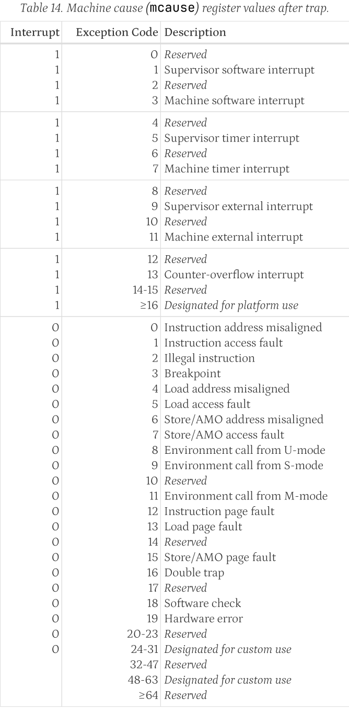
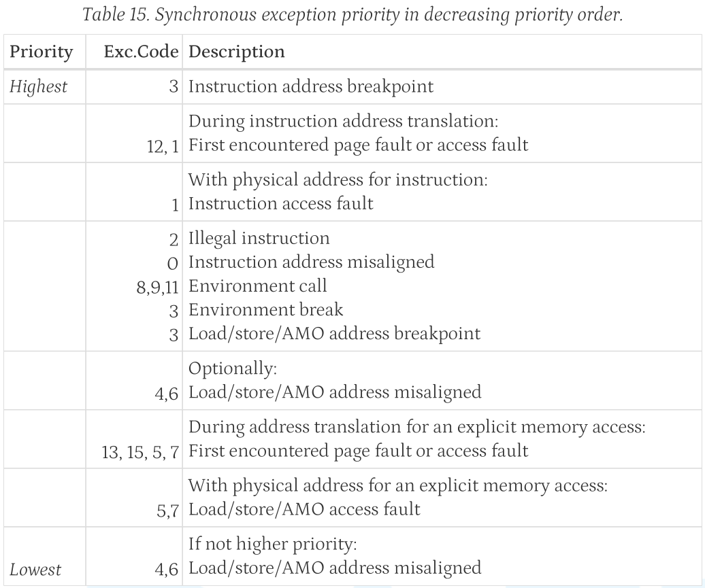

# 环境

没必要用vim。

关于IntelliSense，VSCode需要安装`c/c++`、`Makefile Tools`插件，至少这在PA1中还有点用。到PA2的abstract machine中，这个插件貌似就没法识别出`gcc -D`定义的一堆define了❓

> 因为是用make进行编译的复杂项目，`c/c++` IntelliSense 需要知道具体是怎么make的，所以必须安装`Makefile Tools`才不会出现一堆"Identifier not found"红线，见[Configure C/C++ IntelliSense - Configuration providers](https://code.visualstudio.com/docs/cpp/configure-intellisense#_configuration-providers)：`Ctrl+Shift+P` `C/C++ Change Configuration provider` -> Select `Makefile Tools`，"If it identifies only one custom configuration provider, this configuration provider is automatically configured for IntelliSense"

## 调试NEMU

可以配置到VSCode里调试，传入`-nb`打印出make gdb时产出的gdb命令，配置vscode的`launch.json`。

> 以nemu部分的调试为例，`make gdb`给出了`gdb -s /home/hc/ics-pa-2023/nemu/build/riscv32-nemu-interpreter --args /home/hc/ics-pa-2023/nemu/build/riscv32-nemu-interpreter --log=/home/hc/ics-pa-2023/nemu/build/nemu-log.txt`，于是在vscode中生成调试配置文件`launch.json`，Add Configuation，选择`Nemu GDB`
> 
> ```json
> {
>     "version": "0.2.0",
>     "configurations": [
>         {
>             "name": "Nemu GDB",
>             "type": "cppdbg",
>             "preLaunchTask": "Make",
>             "request": "launch",
>             "program": "${workspaceFolder}/build/riscv32-nemu-interpreter",
>             "args": [
>                 "--log=${workspaceFolder}/build/nemu-log.txt",
>             ],
>             "stopAtEntry": false,
>             "cwd": "${fileDirname}",
>             "environment": [],
>             "externalConsole": false,
>             "MIMode": "gdb",
>             "setupCommands": [
>                 {
>                     "description": "Enable pretty-printing for gdb",
>                     "text": "-enable-pretty-printing",
>                     "ignoreFailures": true
>                 },
>                 {
>                     "description": "Set Disassembly Flavor to Intel",
>                     "text": "-gdb-set disassembly-flavor intel",
>                     "ignoreFailures": true
>                 }
>             ]
>         },
>     ]
> }
> ```

其实用惯了gdb，也就`b func` `n` `s` `layout split` `p EXPR`，直接在Terminal里调试也挺方便的。

## 调试AM+客户程序

用自己写的nemu sdb只能在指令的层面上调试，不是很方便，等把klib中的`printf`实现了，就可以用`printf`调试了。

只要通过了am-kernels中的cpu-test以及PA2.4自己写的详尽test，出错的地方就不可能是nemu了。只要客户程序能在native上正常运行，那么客户程序部分也没有错。那么错的只可能是am的部分了，用`printf`也差不多够用。

# （需要补习的）前置知识

- RISC-V：PA2是unprivileged，CS61C就够用了。PA3涉及privilege。
- Makefile：虽然PA1中可以不用理解Makefile，但PA2里就需要全部读懂Makefile了，所以最好一开始就掌握make的语法。笔记见[Notes](https://github.com/Holence/Notes/blob/main/Tools/Make/Make.md)
- ELF：PA2.4和PA3.3中都要手写解析ELF，可以看看《System V generic ABI》第四五章，笔记见[Notes](https://github.com/Holence/Notes/blob/main/OS/ELF.md)

# 重要信息

## 关于优化

看宏不顺眼，手贱把nemu中`pattern_decode`和`pattern_decode_hex`写成了循环的形式，导致运行速度降低了至少20倍，导致mario运行时FPS为0，还原为宏后FPS可以到10（`NR_FRAMESKIP==1`的情况）！

## 关于AM

AM的五个模块：

- TRM所需的最简单的运行时环境 —— PA2.3
  - init，`start.S: _start()`，具体做了啥❓
    
    halt，将客户程序`main()`的返回值，约定使用`a0`寄存器传返回值，通过`ebreak`指令让nemu终止，并将传入的返回值作为`nemu_state.halt_ret`，作为判断`Good/Bad Trap`的依据，最后退出nemu。
    
    > gcc的输出也能说明这点，单纯的程序文件的机器码并不包含`_start`和`ebreak`，这些都是运行环境（操作系统）附加的东西
    >
    > ```bash
    > cd /am-kernels/tests/cpu-tests
    > 
    > # 仅输出汇编
    > gcc -S tests/dummy.c -o dummy.s
    > # 或输出机器码
    > gcc -c tests/dummy.c -o dummy.o
    > objdump -d dummy.o
    > # 发现里面没有_start()和ebreak
    > # dummy.o是不能被操作系统运行的
    > 
    > # 编译整个可执行文件
    > gcc tests/dummy.c -o dummy
    > objdump -d dummy
    > # 发现在_start()函数中有ebreak，这并不是main()函数
    > ```
  - 一些通用（ISA架构无关）的库函数
- IOE (I/O Extension) 访问外设的接口 —— PA2.5
- CTE (Context Extension) 上下文扩展
  - `ecall`，约定使用`a7`寄存器传参
- VME (Virtual Memory Extension) 虚存扩展
- MPE (Multi-Processor Extension) 多处理器扩展

## 关于fceux红白机模拟器画面无显示

做完声卡后运行红白机模拟器跑mario，发现程序在跑，帧率也有，按I键进入游戏，也可以听到声音，但就是VGA没有任何显示。

解决方法：`/fceux-am/src/drivers/sdl/sdl.cpp`的`FCEUD_Update()`中，把关于刷新屏幕的函数调用`BlitScreen()`以及包裹它的判断都删了，在函数的最前面这样调用就行了。（nemu的声卡开启后，那些判断都无法满足，不懂原理❓）

```c
if(XBuf && (inited&4)) {
  BlitScreen(XBuf);
}
```

## 内存分布

`/abstract-machine/scripts/linker.ld`中规定了几个地址，怎么堆在栈的上面❓跟普遍的内存结构模型不一样啊？？

```
PMEM_END:       0x88000000
                👆HEAP
_heap_start:    0x81C1A000
_stack_pointer: 0x81C1A000
                👇STACK
_stack_top:     0x81C12000
lut[128]:       0x81C11230
_pmem_start:    0x80000000
```

还有，也没见`_stack_top`在哪里被使用啊？确实应该添加一个检查是否超过栈顶的代码，不然随手在函数内设个大数组，就把全局变量给抹没了：

> bad-apple的案例
>
> 这里不能用栈来存大数组！！！
>
> `uint32_t buffer[VIDEO_ROW * VIDEO_COL];`
>
> 因为`/abstract-machine/scripts/linker.ld`中把客户程序的栈区写死了，为0x8000个字节（32KB）
>
> ```
> _stack_top = ALIGN(0x1000);
> . = _stack_top + 0x8000;
> _stack_pointer = .;
> ```
>
> `0x8000 == 32768 Bytes`
>
> 而如果是`128x96`的尺寸，`96 * 128 * 4 == 49152 Bytes`
>
> `buffer`的地址为`0x81C0DFB0`，已经跨越了_stack_top的底线，跑到了全局变量区
>
> `buffer`比`lut`的地址还低，buffer[index]是往高处写，把全局变量区都抹了，调用`ioe_write`时函数都找不到

# PA1

制作简易的调试器（因为硬件都是模拟出来的，打印寄存器、内存也就是打印出数组中的值）。读代码，找到需要调用的函数或需要访问的static变量（应该是需要手动添加include的）。

```
(nemu) x 8 $pc
0x80000000: 0x00000297 0x00028823 0x0102c503 0x00100073 
0x80000010: 0xdeadbeef 0x5a5a5a5a 0x5a5a5a5a 0x5a5a5a5a 
(nemu) px *($pc)
0x00000297
(nemu) px *($pc+4*4)
0xdeadbeef
```

## 1.3

大致就是通过`make menuconfig`运行kconfig工具在terminal的图形化界面中进行个性化配置，产生的`include/config/auto.conf`将会用于`make`的个性化编译，产生的`include/generated/autoconf.h`将会用于c语言代码中的`#ifdef`。

对于那些看不懂的宏定义，可以在makefile中加入一行，让输出预编译的代码（出自[第5课的PPT](http://why.ink:8080/static/slides/ICS2023/05.pdf)）

```makefile
# ./nemu/scripts/build.mk
$(OBJ_DIR)/%.o: %.c
	@echo + CC $<
	@mkdir -p $(dir $@)
	@$(CC) $(CFLAGS) -c -o $@ $<
	
# gcc preprocessing file, 方便理解那些看不懂的宏展开
	@$(CC) $(CFLAGS) -E -MF /dev/null $< | grep -ve '^#' | clang-format - > $(basename $@).i
	
	$(call call_fixdep, $(@:.o=.d), $@)
```

## 1.4

`p EXPR`指令需要自己写表达式求值的工具。

```
(nemu) p <expr>
其中 <expr> 为 <decimal-number>
  | <hexadecimal-number>    # 以"0x"开头
  | <reg_name>              # "$ra" / "$pc"
  | "(" <expr> ")"
  | <expr> "+" <expr>
  | <expr> "-" <expr>
  | <expr> "*" <expr>
  | <expr> "/" <expr>
  | <expr> "==" <expr>
  | <expr> "!=" <expr>
  | <expr> "&&" <expr>
  | "*" <expr>              # 指针解引用（只用支持数值或寄存器的值作为地址，不用支持gdb那样的变量作为地址）
```
 
最后随机生成测试，是先随机出一个表达式（与寄存器、内存相关的不用随机测试，自己手动测几个就行了），然后写入一个`temp.c`的临时文件，编译，开进程运行，`./gen-expr 1000 > input`生成多组结果和表达式

> 过滤除以0的case，可以用signal，但遇到0乘以时`(1 / 0) * 0`，运行却没有异常，这种实在没法探测
>
> 完全可能是很复杂的形态`(6-2*3)*(1 - 2/(1-1))`，到nemu里运行是先计算出`1-1`为0，再`2/0`，肯定会报错的。这种只能运行报错后手动删掉这种case了

最后修改nemu的main函数，读文件，调用`expr()`，对比结果

```c
// nemu-main.c (only for test expr)
#include <common.h>

void init_monitor(int, char *[]);
void am_init_monitor();
void engine_start();
int is_exit_status_bad();
word_t expr(char *e, bool *success);

int main(int argc, char *argv[]) {
  /* Initialize the monitor. */
#ifdef CONFIG_TARGET_AM
  am_init_monitor();
#else
  init_monitor(argc, argv);
#endif

  /* Start engine. */
  // engine_start();

  FILE *file = fopen("/home/hc/ics-pa-2023/nemu/tools/gen-expr/input", "r");
  if (file == NULL) {
    perror("Error opening file");
    return 1;
  }

  word_t reference;
  char expression[32];

  int total = 0;
  int correct = 0;
  bool success = true;
  while (fscanf(file, "%u %[^\n]", &reference, expression) == 2) {
    printf(ANSI_FMT("%s = %u\n", ANSI_FG_BLACK), expression, reference);
    total++;
    word_t result = expr(expression, &success);
    if (result != reference) {
      printf(ANSI_FMT("%u - Not Match\n", ANSI_FG_RED), result);
      getc(stdin);
    } else {
      correct++;
      printf(ANSI_FMT("Match\n", ANSI_FG_GREEN));
    }
  }
  fclose(file);

  printf(ANSI_FMT("Total Test: %d\nCorrect: %d\n", ANSI_FG_MAGENTA), total, correct);

  return is_exit_status_bad();
}
```

## 1.5

固定32个可用的watchpoint，用链表分别存储“使用中”、“空闲”队列。

如果`wp_check_changed()`中就只是`nemu_state.state = NEMU_STOP`，那运行时设置`w $pc`，然后一直`c`运行到最后，会到`hostcall.c: invalid_inst()`，说明是已经到了最后，却没退出成功。退出的时候是`ebreak`指令去做`set_nemu_state(NEMU_END, thispc, code)`，这时候就不需要再`wp_check_changed()`了。所以在`wp_check_changed()`中设置`nemu_state.state = NEMU_STOP`时，弄个判断：

```c
if (nemu_state.state != NEMU_END) {
  nemu_state.state = NEMU_STOP;
}
```

## 必答题

过

# PA2

## 2.2

编写RISC-V32I_M的模拟器，在外部用risc-v编译器，编译一些c语言写的rics-v机器码用于测试，之后用nemu运行之。

> [!IMPORTANT]
> - 指令集见《The RISC-V Instruction Set Manual Volume I Unprivileged Architecture》 Instruction Set Listings，其实UCB的green card也都够用了
> - imm解析可以参考[CS61CPU](https://cs61c.org/su24/projects/proj3/#task-7-2-immediate-generator)，要记得imm都是要sign-extend成32/64位的。
> - load进来的数据也要sign-extend
> - 做`mul`、`mulh`时需要把`uint32_t`转换为`int64_t`去做乘法。但由于bit extend的特性，从`uint32_t`到更多位的`int64_t`需要先到`int32_t`再到`int64_t`，这样才能让32位的负数正确地sign-extend扩展为64位的负数。

> [!TIP]
> ecall不用做，等PA3再说

---

为了方便测试，在`/abstract-machine/scripts/platform/nemu.mk`中的NEMUFLAGS加上`-b`，让传入nemu的参数开启batch mode，这样就不用每次开始运行了还要手动`c`运行和`q`退出。之后直接运行`make ARCH=riscv32-nemu run`就能运行所有的测试了。

> [!IMPORTANT]
>  - 至少在做cpu-test时，把`/abstract-machine/Makefile`里把`CFLAGS   += -O2`改为`O0`。在`O2`优化的情况下，发现很多测试编译出来给check函数的`a0`直接就设为了编译器预想的值，根本没有运行nemu计算的指令！！
>  - string和hello-str还需要实现额外的内容才能运行，现在运行会报错的，记得跳过（我就忘了，看到汇编里`sb a0,1016(a5) # a00003f8 <_end+0x1fff73f8>`写着超出了_end的地址，意识到不应该是我的问题，才到文档里查到需要跳过这两个测试）

> [!TIP]
> am-kernels，abstract-machine都是啥？下面两个小节会介绍的。

❓很奇怪，当我在nemu中`make menuconfig`选中了Enable Address Sanitizer后，有时候编译就会报`AddressSanitizer:DEADLYSIGNAL`的错。

---

> [!NOTE]
> RTFSC理解指令执行的过程
>
> `init_monitor()`的部分就是初始化nemu，并装入客户程序的IMAGE到内存pmem，之后便进入`engine_start()`，进入sdb互动界面或者`cpu_exec()`，客户程序指令执行的过程发生在`cpu_exec()`中。
>
> `execute()`的循环中`exec_once()`, `s->pc`为当前指令的地址，进入`isa_exec_once()`后，`inst_fetch()`取回二进制指令，静态下一跳地址设置为`s->snpc = s->pc + 4`，进入`decode_exec()`，动态下一跳地址默认设为`s->dnpc = s->snpc`，在指令执行的过程中，那些跳转指令会改变`s->dnpc`的值。后面是一堆附带goto “INSTPAT_END”的block，一旦`(((uint64_t)INSTPAT_INST(s) >> shift) & mask) == key`，即匹配成功，进入`decode_operand()`解析立即数和读取寄存器src1和src2，最后执行对应的`EXECUTE_EXPR`。出去的时候`x0`寄存器要手动归零（因为是软件实现的不作判断，写入就写入了，硬件写入`x0`是不通的）。出去让cpu的下一跳设为`cpu.pc = s->dnpc`，最后处理trace的信息、处理外设。只要`nemu_state.state == NEMU_RUNNING`，就以此循环往复。
>
> 直到客户程序发出ebreak的指令而`NEMU_END`（要么是正常运行结束`ret==0`，要么是中途异常退出`ret!=0`），或者nemu出现内部错误而`NEMU_ABORT`，结束`execute()`的循环，退出nemu。

## Makefile解析

运行am-kernels中测试的时候，`make ARCH=riscv32-nemu ALL=dummy run`会生成`Makefile.dummy`，其中的内容为

```
NAME = dummy
SRCS = tests/dummy.c
include /abstract-machine/Makefile
```

接下来会`make -s -f Makefile.dummy ARCH=$(ARCH) $(MAKECMDGOALS)`去运行这个Makefile，其实就是在引用`/abstract-machine/Makefile`中的内容（PA2.3中会要求仔细阅读），其中先编译生成一堆OBJS，再`@$(LD) $(LDFLAGS) -o $(IMAGE).elf --start-group $(LINKAGE) --end-group`链接成ELF文件，最后用`@$(OBJCOPY) -S --set-section-flags .bss=alloc,contents -O binary $(IMAGE).elf $(IMAGE).bin`抽取出部分内容成为裸二进制文件，这是nemu需要的程序文件IMAGE（.bin），最后通过`$(MAKE) -C $(NEMU_HOME) ISA=$(ISA) run ARGS="$(NEMUFLAGS)" IMG=$(IMAGE).bin`运行nemu中Makefile的`make run`。

```makefile
image: $(IMAGE).elf
	@$(OBJDUMP) -d $(IMAGE).elf > $(IMAGE).txt
	@echo + OBJCOPY "->" $(IMAGE_REL).bin

# -S (--strip-all)
#    Do not copy relocation and symbol information from the source file.  Also deletes debug sections.
# -S之后只是少了些附加信息，依旧可以被linux运行、被readelf、被objdump
# -O binary 是保留raw binary file，不能被linux运行、被readelf、被objdump
    @$(OBJCOPY) -S --set-section-flags .bss=alloc,contents -O binary $(IMAGE).elf $(IMAGE).bin
```

## 2.3

实现几个与ISA无关的通用库函数，理解abstract machine作为nemu(cpu)与OS之间的中间层的奥义。

```
// trm.c
void _trm_init() {
  int ret = main(mainargs);
  halt(ret);
}
```

nemu相当于是一个可以一次性执行完一段程序最后返回一个return值的cpu，仅仅是一个图灵机，运行完就结束了。

nemu是纯“硬件”的裸机，am-kernels里的程序是普通用户写出来的客户程序，abstract-machine是运行环境。

客户程序依赖于AM，见[AM的五个模块](#关于AM)

所以就需要一个抽象层abstract-machine

nemu的运行是直接读入一整个IMAGE，是am-kernels的客户程序和abstract-machine全部编译、链接在一起的结果，在nemu看来就是一堆指令，相当于开机后就只跑这一个运行环境中的一个程序。也就是说客户程序通过abstract-machine的加持，就可以跑在任意一种CPU上（物理世界的CPU也性）。

## 2.4

itrace、iringbuf、mtrace就在nemu里动动手脚即可。

ftrace需要读取elf，要找出当前运行的指令行对应在哪个函数内，要找的是Section里的symtab和strtab两个表，symtab中有函数的地址信息，strtab里有所有字符串的信息。所以需要定位到Section Header Table，找到其中symtab和strtab两个表的地址。运行程序时碰到`jalr`和`jal`两个指令，判断是call还是ret，看当前指令的pc位于symtab中哪个function的地址范围内，则查找到strtab中该函数的名字。

要ftrace的话，运行nemu就需要额外传入elf文件（因为`$(IMAGE).bin`文件是raw binary，啥都没了），在`/abstract-machine/scripts/platform/nemu.mk`中设置运行nemu时要传入的参数`ARGS="-e $(IMAGE).elf $(NEMUFLAGS)"`

ftrace实现出来只是在实时打印全部的函数调用过程，用个int depth记录深度然后打印缩进即可，感觉也没多少机会会用这个功能。若要实现backtrace打印某个时刻的函数调用栈，得用栈的数据结构push、pop记录函数，懒得做了。

---

> [!NOTE]
> 不匹配的函数调用和返回，尝试结合反汇编结果, 分析为什么会出现这一现象：看反汇编代码，在f2中调用f1的是正常的`jalr rs`（`jalr ra, rs, 0`），所以触发打印log`call f1`，而f1跳向f0用的是`jr`（`jalr x0, rs, 0`），也就是不把pc存到`ra`就跳出去，将来不用跳回到这条指令+4的地方，而是直接跳回到f1被调用的地方，也就是f2中调用处+4的地方。`jr`指令因为没有存`ra`，也就没被monitor视为是在call，所以从f1跳入f0的时候并不会触发打印`call f0`，而f0要返回了，ret指令会触发打印`ret f0`，所以就出现了`call f1`接着`ret f0`的现象。
>
> 同理，为什么`call f1`对应的是`ret f3`？是因为f0中也是`jr`，`call f1`后隐藏地`call f0`，又隐藏地`call f3`，f3里正常调用f2两次，出来的时候自然打印了`ret f3`。
>
> 这里如果把`jr`这种情况也算作call的话，并不能解决问题，因为`jr`没有对应的`ret`，所以会匹配不上的。
> 
> ```
>   Call f2
>     Call f1 # then call f0, call f3
>       Call f2
>         Call f1 # then call f0
>         Ret  f0
>       Ret  f2
>       Call f2
>         Call f1 # then call f0
>         Ret  f0
>       Ret  f2
>     Ret  f3
>   Ret  f2
> ```

---

要编写详尽的test来测试klib，懒得自己写了，看有人引用了glibc的测试，我也引用一下吧: https://github.com/alelievr/libft-unit-test/blob/master/hardcore-mode/

> [!IMPORTANT]
> 先在native上用glibc的库函数来测试（先保证这些test本身书写正确）, 然后在native上测试你的klib测试（再保证klib正确）, 最后再到NEMU上运行这些测试代码来测试你的NEMU实现（最后保证nemu正确）

在native上测试klib时出现问题，只能用二分法找到出错的用例❓klib的部分没法调试啊？因为也还没做printf，就只能把对应的klib函数和测试用例复制到一个临时c中调试、修改（最好把函数名修改掉，如果就是什么strcmp，它也不报错，直接神不知鬼不觉地就去用c的库了？）。

---

difftest部分，`/nemu/src/cpu/difftest/ref.c`没有任何用处，在`nemu/src/cpu/difftest/dut.c`的`init_difftest()`中已经用`dlsym()`去`/nemu/tools/spike-diff/build/riscv32-spike-so`去寻找函数了，其实函数在`/nemu/tools/spike-diff/difftest.cc`中。

寻找spike中定义的寄存器顺序，在`/nemu/tools/spike-diff/repo/disasm/regnames.cc`中有，发现和nemu是一致的。

## 2.5

内存映射：不同外设的寄存器被分别设定（约定）到nemu内存中的不同区域（均是高于0xa0000000的一个个片区），给CPU的同样是读写内存的指令，但若发现地址不是普通内存的地址，则转而读写各种外设内部的寄存器。

CPU方面，在nemu架构中，会被编译为访问内存的指令，从而通过`paddr_read()`/`paddr_write()`判断为不是普通内存地址后（nemu中外设的真实存储空间不在`pmem`数组里，而是`init_map()`里`malloc()`出来的堆空间。毕竟这地址本来就是虚拟的，读写的地方就是要到外设的寄存器，不在内存里的），进入`mmio_read`/`mmio_write`，根据nemu开机时`init_map()`设定好的`IOMap maps[NR_MAP]`，通过外设对应的callback函数，在read的时候模拟“外设准备寄存器的值，CPU读取所需的外设寄存器的值”，在write的时候模拟“CPU传值入外设寄存器，外设读取值作出后续处理工作”。

客户程序与运行环境方面，am-kernel里的程序会通过下面三个abstract-machine的IOE API来访问外设，`io_read`/`io_write`通过`lut`（look up table）查找读写外设“抽象”寄存器`reg_index`对应的函数，这些函数（以及`putch`）再调用`inb`/`outb`进行“内存”读写，最终这指令就会触发nemu里的`paddr_read()`/`paddr_write()`。

```c
// 
bool ioe_init();
io_read(reg_index) // 是包裹了void ioe_read(int reg, void *buf)的宏
io_write(reg_index, 写入的内容) // 是包裹了void ioe_write(int reg, void *buf)的宏
// reg_index，比如 AM_TIMER_CONFIG，在/abstract-machine/am/include/amdev.h中定义的

// 以及放在了`trm.c`中的`putch()`串口（终端打印）
```

在native中I/O是怎么实现的❓

在通读以及实现这部分的代码时，先读am-kernels中在调用的样子，明白abstract-machine中`ioe.c`“抽象”寄存器对应的函数的功能是啥，再去看nemu中硬件读写要实现的。

### 串口

只写

> [!NOTE]
> 理解mainargs，请你通过RTFSC理解这个参数是如何从make命令中传递到hello程序中的, `$ISA-nemu`和`native`采用了不同的传递方法：
>
> 这里`make ARCH=$ISA-nemu mainargs=I-love-PA run`
>
> `$ISA-nemu`：通过Makefile把`mainargs`编译到客户程序的IMAGE中：nemu.mk中`-DMAINARGS=\"$(mainargs)\"`，在`/am/src/platform/nemu/trm.c`中把`mainargs`存在`char mainargs[]`中，再到调用`hello.c`里的`int main(const char *args)`时，就传入了。
>
> `native`：通过`getenv()`获取到输入的`mainargs`，通过`static void init_platform() __attribute__((constructor))`，在`hello.c`的`main()`运行之前，做了很多其他的操作
>
> 一个示例
> 
> ```c
> #include <stdio.h>
> #include <stdlib.h>
> 
> int main(char *name);
> 
> void __attribute__((constructor)) before_main() {
>   printf("I can get your name from env.\n");
>   char *name = getenv("NAME");
>   int ret = main(name ? name : "root");
>   printf("After main()\n");
>   exit(ret);
>   printf("Nothing goes here\n");
> }
> 
> int main(char *name) {
>   printf("Greetings! @%s is in main()\n", name);
>   return 0;
> }
> 
> void __attribute__((destructor)) before_exit() {
>   printf("Before exiting\n");
> }
> ```
>
> 运行的时候`NAME=Lord ./FILE`就会输出：
>
> ```
> I can get your name from env.
> Greetings! @Holence is in main()
> After main()
> Before exiting
> ```

### 时钟

只读

> [!TIP]
> AM_TIMER_UPTIME的小坑，注意`rtc_io_handler()`里在什么条件下`get_time()`

### 键盘

只读

在`cpu-exec.c`的`execute()`过程中会尝试`device_update()`，SDL2库会读入键盘的信号，触发`send_key()`，用队列记录按键信息。

看看预编译后的结果理解宏，打印`scancode`和`am_scancode`，运行`/am-kernels/tests/am-tests/src/main.c`，观察`scancode`和`am_scancode`。

可以看到`abstact-machine/am/include/amdev.h`和`/am-kernels/tests/am-tests/src/tests/keyboard.c`中对键盘码的编号`AM_KEYS`，与`/nemu/src/device/keyboard.c`中的`NEMU_KEYS`是一样的。

### VGA

- vga控制信息: `0xa0000100`开始的2个32bit寄存器
  - width-height寄存器（只读）
  - SYNC寄存器（只写）: 客户程序调用`__am_gpu_fbdraw()`在fb(vmem)写入屏幕pixel的数据后，会在SYNC REG写入非零值。之后cpu-exec自动vga_update_screen时，便会发现SYNC REG!=0，则让SDL去更新窗口画面。
- vga frame buffer（只写）: `0xa1000000`开始的`width*height`个32bit寄存器

### 声卡

数据流啊流：客户程序buf -> nemu audio sbuf -> SDL stream

第一个流入在AM中实现，只要sbuf不满，即可流入

第二个流入在nemu中实现，只有在SDL audio的callback被调用时，才开始流。

sbuf用一种循环的方式去读写

## 必答题

> [!NOTE]
> TODO: 编译与链接
>
> - 在nemu/include/cpu/ifetch.h中, 你会看到由static inline开头定义的inst_fetch()函数. 分别尝试去掉static, 去掉inline或去掉两者, 然后重新进行编译, 你可能会看到发生错误. 请分别解释为什么这些错误会发生/不发生? 你有办法证明你的想法吗?
> - 在nemu/include/common.h中添加一行volatile static int dummy; 然后重新编译NEMU. 请问重新编译后的NEMU含有多少个dummy变量的实体? 你是如何得到这个结果的?
> - 添加上题中的代码后, 再在nemu/include/debug.h中添加一行volatile static int dummy; 然后重新编译NEMU. 请问此时的NEMU含有多少个dummy变量的实体? 与上题中dummy变量实体数目进行比较, 并解释本题的结果.
> - 修改添加的代码, 为两处dummy变量进行初始化:volatile static int dummy = 0; 然后重新编译NEMU. 你发现了什么问题? 为什么之前没有出现这样的问题? (回答完本题后可以删除添加的代码.)

# PA3

开始进入原始级操作系统的世界！

❓下面的说法待核查

为了让操作系统作为奶妈，客户程序作为宝宝，客户程序将只被允许执行非特权指令(unprivileged)，而操作系统才能执行特权指令(privileged)。硬件上需要一个保存mode的“状态寄存器”，规定只有当状态寄存器表示处于特权模式时，才能运行特权指令。客户程序需要调用操作系统的某个函数，也就是Trap❓System Call❓，修改状态寄存器为特权模式，再去执行特权指令。

这个系统的函数，广义上为Trap（包括Exception异常、System Call系统调用、Interrupt中断），通过传入index（Trap的原因），查表得到某个Trap的函数。

## 3.2

最好还是能先看看客户程序、操作系统调用时的接口，再去AM里写实现

```c
Context *simple_trap(Event ev, Context *ctx); // 可自定义的 user_handler

cte_init(simple_trap);
// 设置 exception entry 地址: asm volatile("csrw mtvec, %0" : : "r"(__am_asm_trap)); （用mtvec寄存器存储）
// 设置 __am_asm_trap 中后续会调用的 user_handler

yield();
// ❓asm volatile("li a7, -1; ecall"); 传入的参数a7怎么没用啊？不是用a7传入cause吗？
// 客户程序触发自陷 EVENT_YIELD
// 使用ecall指令，把nemu引导到mtvec指向的__am_asm_trap中，保存上下文（全部的寄存器，以及mcause、mstatus、mepc），然后进入__am_irq_handle根据mcause进行事件分发，跳到对应的用户定义的handler，最后回到_am_asm_trap去恢复上下文，最后mret到正确的mepc处。
// 做完之后mret指令退出，回到am层的yield()，yield()结束后回到客户程序
```

客户程序用am中的接口调用ecall，让nemu定向到一个am中写死的__am_asm_trap，再由__am_irq_handle跑到用户自定义的simple_trap，最后用mret回到原来的地方。

> 1.6. Exceptions, Traps, and Interrupts
> We use the term "exception" to refer to an unusual condition occurring at run time associated with an instruction in the current RISC-V hart. 
> We use the term "interrupt" to refer to an external asynchronous event that may cause a RISC-V hart to experience an unexpected transfer of control. 
> We use the term "trap" to refer to the transfer of control to a trap handler caused by either an exception or an interrupt.

所以目前做的部分属于exception

### 实现异常响应机制

在nemu中实现csr寄存器的定义，以及csr的基础指令`CSRRW`、`CSRRS`，以及中断相关的指令`ecall`和`mret`。

ecall中mcause不知道应该设为啥。用spike进行difftest，可以看到`__am_asm_trap`中进行`csrr t0,mcause`的时候出现了不匹配，它说正确的`t0`（也就是`mcause`）应该是`0x0000000b`（十进制是11）。

再看到手册里"3.3.1. Environment Call and Breakpoint"中说会生成`environment-call-from-M-mode`的exception，可以对应到`mcause`中`Interrupt==0`中的第11个，看来却是如此。





记得要再nemu中找个地方初始化`mstatus`为0x1800

> [!TIP]
> 到此运行`am-tests`的`intr.c`时，可以正常运行（difftest不报错，无未实现的指令）到`AM Panic: Unhandled event`

### 保存上下文

`trap.S`同样是看不懂的宏，在Makefile里添加输出preprocess的结果，就能看懂了。

就是开了`(32+3)*4 bytes`的栈空间新建了一个Context结构体，用于传入`__am_irq_handle`。低地址处为Context结构体的开头，高地址处为结尾，可以看到先存了gpr（跳过了`x0`和`sp`），然后存`mcause`，`mstatus`，`mepc`。要求“将地址空间信息与0号寄存器共用存储空间”，也就是哪个`void* pdir`（这东西在`abstract-machine/am/src/riscv/nemu/vme.c`中会从Context结构体中被索要的），因为是地址数据，长度也是4个字节，那就用个union把`gpr[32]`和`pdir`放在一起就行了，存取`pdir`的时候访问的就是`gpr[0]`的格子。

最后记得验证：用nemu的sdb在__am_asm_trap处设置断点，打印所有寄存器（包括csr）的值，与__am_irq_handle中printf出来的所有信息，进行比较。

> [!TIP]
> 到此运行`am-tests`的`intr.c`时，可以正常运行（difftest不报错，无未实现的指令）到`AM Panic: Unhandled event`

### 事件分发

__am_irq_handle中判断`c->mcause`为11（上文的`environment-call-from-M-mode`），分配`ev.event`

> [!TIP]
> 到此运行`am-tests`的`intr.c`时，可以正常运行（difftest不报错，无未实现的指令），不过诡异的是等很长一段时间后，连续地输出`y`
>
> 现在的状况是运行完`for (volatile int i = 0; i < 10000000; i++);`后，`yield()`里`ecall`，然后`mret`出来又到了`ecall`，从而`ecall`，`ecall`，`ecall`……
>
> 下一小节里修这个bug

### 恢复上下文

> 事实上, 自陷只是其中一种异常类型. 有一种故障类异常, 它们返回的PC和触发异常的PC是同一个, 例如缺页异常, 在系统将故障排除后, 将会重新执行相同的指令进行重试, 因此异常返回的PC无需加4. 所以根据异常类型的不同, 有时候需要加4, 有时候则不需要加.

作为RISC，`mret`的作用仅仅就是恢复`mepc`，所以就需要在软件（操作系统，也就是相当于am）中，根据Trap的不同类型，修改`mepc`为正确的值。

# 二周目问题

- 1.2 如果没有寄存器, 计算机还可以工作吗? 如果可以, 这会对硬件提供的编程模型有什么影响呢?
  就算你是二周目来思考这个问题, 你也有可能是第一次听到"编程模型"这个概念. 不过如果一周目的时候你已经仔细地阅读过ISA手册, 你会记得确实有这么个概念. 所以, 如果想知道什么是编程模型, RTFM吧.
- 1.3 对于GNU/Linux上的一个程序, 怎么样才算开始? 怎么样才算是结束? 对于在NEMU中运行的程序, 问题的答案又是什么呢?
- 1.4 我们在表达式求值中约定, 所有运算都是无符号运算. 你知道为什么要这样约定吗? 如果进行有符号运算, 有可能会发生什么问题?
- 1.6 如果你在运行稍大一些的程序(如microbench)的时候使用断点, 你会发现设置断点之后会明显地降低NEMU执行程序的效率. 思考一下这是为什么? 有什么方法解决这个问题吗?
与此相关的问题还有: NEMU中为什么要有nemu_trap? 为什么要有monitor?
- 1.6 [How debuggers work](https://eli.thegreenplace.net/2011/01/23/how-debuggers-work-part-1/)
- 2.3 为什么要有AM？操作系统也有自己的运行时环境. AM和操作系统提供的运行时环境有什么不同呢? 为什么会有这些不同?
- 2.5 读am-kernels中的LiteNES
- 3.1 什么是操作系统?
- 3.2 这些程序状态(x86的eflags, cs, eip; mips32的epc, status, cause; riscv32的mepc, mstatus, mcause)必须由硬件来保存吗? 能否通过软件来保存? 为什么?

TODO:
- 优化！！ftrace 在程序性能优化上的作用？统计函数调用的次数，对访问次数较多的函数进行优化，可以显著提升程序的性能。
- 宏展开比循环少多少指令？
